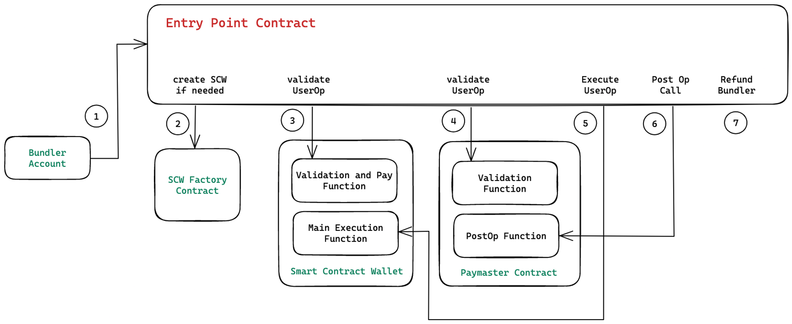
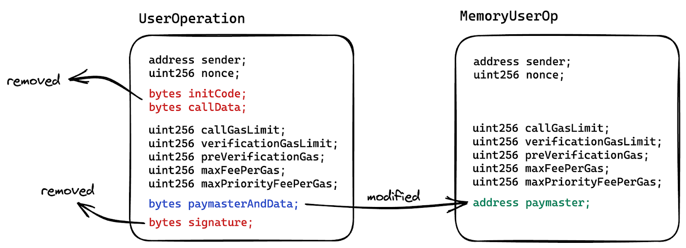

# Decoding EntryPoint and UserOperation with ERC-4337 Part 1

Every one is talking about Account Abstraction proposed by ERC-4337 and developers trying to find a way to adopt it. Some concepts you might have heard about are Smart Contract Wallets, EntryPoint contract, UserOperation, Paymasters, Bundlers etc. but few understand these concepts in detail.

The target audience for this article is developers who are familiar with the concept of account abstraction and have basic knowledge of concepts mentioned above but they don’t understand the detailed working of smart contracts related to it.

In this article we’ll try to understand EntryPoint contract line by line and try to visualise the transaction flow via EntryPoint contract and we’ll also learn how to initialise values in a UserOperation on the client side.

:::tip

If you have no knowledge of Account Abstraction but have some knowledge of smart contracts, I would recommend you read [this article](https://www.alchemy.com/blog/account-abstraction) to understand it.

:::

## Basic Definitions

Before going deep into transaction flow, let’s first understand the basic definitions of terms we’ll use in this article.

### UserOperation

Data structure that describes a transaction to be sent on behalf of a user. It is not an actual Blockchain transaction but is similar to it as it contains fields like `sender`, `to`, `calldata`, `nonce`, `signature`,`maxFeePerGas`, `maxPriorityFeePerGas` and more. We’ll go through them one by one.

### EntryPoint

It is a singleton contract that’s used as an entry point to execute bundles of UserOperations. It has two entry point methods `handleOps` and `handleAggregatedOps` . We’ll go through only the handleOps method and its flow in this article. We’ll cover `handleAggregatedOps` in the next article.

### Smart Account

It is a smart contract that acts as a user wallet where all user assets are stored. You can program it to validate transactions sent via SA before executing them. That’s why these are sometimes referred to as programmable accounts.

### Paymaster

It is a smart contract that acts as a gas tank and is used to sponsor transactions where a third party pays the transaction fee on behalf of the user. The sponsor stores the gas beforehand using Paymaster which then can be used during the transaction flow via EntryPoint.

Here we have visualised a basic, high level account abstraction transaction flow.



:::tip

Code Reference: [View on Github](https://github.com/eth-infinitism/account-abstraction/blob/develop/contracts/core/EntryPoint.sol)

:::

Referenced Version

0.6.0

## Data Structures used in EntryPoint

In EntryPoint contract, there are mainly three data structures that are used which are `UserOperation`, `UserOpinfo`, `MemoryUserOP` Only `UserOperation` is passed from outside to EP and other structs are created and used internally only for gas optimisation and information passing purpose.

```

struct UserOperation {
	address sender;
	uint256 nonce;
	bytes initCode;
	bytes callData;
	uint256 callGasLimit;
	uint256 verificationGasLimit;
	uint256 preVerificationGas;
	uint256 maxFeePerGas;
	uint256 maxPriorityFeePerGas;
	bytes paymasterAndData;
	bytes signature;
}

```

```

struct UserOpInfo {
	MemoryUserOp mUserOp;
	bytes32 userOpHash;
	uint256 prefund;
	uint256 contextOffset;
	uint256 preOpGas;
}

```

```

struct MemoryUserOp {
	address sender;
	uint256 nonce;
	uint256 callGasLimit;
	uint256 verificationGasLimit;
	uint256 preVerificationGas;
	address paymaster;
	uint256 maxFeePerGas;
	uint256 maxPriorityFeePerGas;
}

```

Let’s understand these struct and their fields in detail.

## User Operation

Lets start with `UserOperation` and understand each field

| Field                          | Description                                                                                                                                                                                                                                                                                                                                                                                                                                      |
| ------------------------------ | ------------------------------------------------------------------------------------------------------------------------------------------------------------------------------------------------------------------------------------------------------------------------------------------------------------------------------------------------------------------------------------------------------------------------------------------------ |
| `address sender`               | Smart Contract Wallet address                                                                                                                                                                                                                                                                                                                                                                                                                    |
| `uint256 nonce`                | Nonce value verified in EntryPoint to avoid replay attacks. SCW is not expected to implement this replay prevention mechanism.                                                                                                                                                                                                                                                                                                                   |
| `bytes initCode`               | Bytes containing calldata for SCW Factory contract. First 20 bytes are Factory contract address and rest is calldata of function to be called on Factory Contract.                                                                                                                                                                                                                                                                               |
| `bytes callData`               | Calldata of function to be executed on SCW. It can be any function on SCW (e.g. execute or executeBatch) which usually then further calls a dApp smart contract. It can even call other methods of SCW internally as well. It's upto you how you implement this method in SCW.                                                                                                                                                                   |
| `uint256 callGasLimit`         | Gas limit used while calling the SCW method from EntryPoint contract using 'callData' above.                                                                                                                                                                                                                                                                                                                                                     |
| `uint256 verificationGasLimit` | This value is used for multiple purposes. It is used as gas limit while calling SCW Factory contract, calling verification methods on SCW and Paymaster and calling postOp method on Paymaster. In short this is gas limit used in calling verification methods on SCW and Paymaster along with postOp method on Paymaster. To be more precise, on top of it, there are other lines in EP whose gas used is accounted in `verificationGasLimit`. |
| `uint256 preVerificationGas`   | This field is also critical to understand properly. In short, bundler can make profit using this field, if used properly. This is the gas counted on EP as a part of transaction execution which can't be tracked on chain using `gasleft()` opcode.                                                                                                                                                                                             |
| `uint256 maxFeePerGas`         | This is the max fee per unit of gas that UserOp is willing to pay. It is similar to how maxFeePerGas is defined in EIP-1559 for gas calculation of Ethereum transaction. EntryPoint uses this field to calculate gas price for the refund calculation to bundler. `gasPrice = min(maxFeePerGas, maxPriorityFeePerGas + block.basefee)`                                                                                                           |
| `uint256 maxPriorityFeePerGas` | This is max priority fee per gas that UserOp is willing to pay. It is similar to how maxPriorityFeePerGas is defined in EIP-1559 for gas calculation of ethereum transaction. `gasPrice = min(maxFeePerGas, maxPriorityFeePerGas + block.basefee)`                                                                                                                                                                                               |
| `bytes paymasterAndData`       | It contains bytes representing paymaster related information. First 20 bytes is paymaster address and rest represents data to be used by Paymaster for verification. It is empty, if paymaster is not used to sponsor the transaction for given UserOp.                                                                                                                                                                                          |
| `bytes signature`              | It represent the data to be passed to SCW for verification purpose. Usually it's the signature of userOpHash signed by the owner of SCW but it can be utilised in other ways also.                                                                                                                                                                                                                                                               |

## MemoryUserOp

This struct is created for internal purposes in EntryPoint. It is simply a memory copy of UserOperation’s static fields. It excludes the callData, initCode, signature and paymasterData part of the ‘paymasterAndData’ field. From the paymasterAndData field, it extracts the paymaster address and add it as ‘paymaster’ field.

In EntryPoint many internal functions are called and instead of passing around the UserOperation object, MemoryUserOp is passed to save on gas whenever possible.

It’s easy to visualise in the diagram below how MemoryUserOp is created from UserOperation. If you observe closely, you can see all bytes type fields are either removed or modified into fixed length types.



## UserOpInfo

This is another internal struct defined in EntryPoint. It contains 5 fields whose values are calculated in EntryPoint using the UserOperation fields.

:::note

It might be a lot to understand all the explanations of fields above. Especially in one sitting. It takes time. I needed to process them multiple times to understand them better. If you get those fields then all good but if you’re still confused, we’ll try to help you understand these fields better when we explain EP code.

:::

| Field                   | Description                                                                                                                                                                                                                                                                                                                                                                                   |
| ----------------------- | --------------------------------------------------------------------------------------------------------------------------------------------------------------------------------------------------------------------------------------------------------------------------------------------------------------------------------------------------------------------------------------------- |
| `MemoryUserOp mUserOp`  | It is the MemoryUserOp object as described above.                                                                                                                                                                                                                                                                                                                                             |
| `bytes32 userOpHash`    | It contains hash of UserOperation object. It creates the hash by first removing the signature field from UserOp, then packing all fields in bytes object and then applying `keccak256` and `abi.encode` functions in solidity on top of it.                                                                                                                                                   |
| `uint256 refund`        | It is the max amount of gas fee deducted from the deposit (paymaster or SCW deposit) before any execution is done in EntryPoint. It is done to ensure that sponsor of the transaction has sufficient amount in deposit to pay for the gas. Later if actual gas used in the operation is less than the `refund`, extra amount is refunded back in sponsor deposit.                             |
| `uint256 contextOffset` | It is the memory offset of context object returned by Paymaster when EP calls validatePaymasterUserOp method. This is calculated to avoid passing the context object itself while calling internal functions, instead this uint256 value is passed around and whenever EP needs context object, it reads from the memory. This is done to save gas in EP.                                     |
| `uint256 preOpGas`      | It contains the gas used on chain till the verification steps are completed in EP + `userOp.preVerificationGas`. It is used later in the execution when EP needs to calculate the actual gas cost used on chain to compare it with the `refund` value. So it can decided whether to refund any extra amount in sponsor deposit or not. On chain gas used is tracked using `gasleft()` opcode. |

## Quick Recap

We understand the basic definitions of key terms used in EntryPoint and we have knowledge of three data structures `UserOperation`, `UserOpInfo`, `MemoryUserOp` and their fields.

We also know that MemoryUserOp and UserOpInfo objects are only created in memory from UserOperation object, mainly to save gas during the operation and to pass on some calculated fields to internal function calls in a structured way. Only UserOperation is passed to EntryPoint from outside.

## Interfaces used in EntryPoint

EntryPoint contract interacts with three major entities: The Wallet Factory contract, Smart Contract Wallet and Paymaster. For Factory contract there is no defined interface but for SmartContractWallet and Paymaster there are interfaces defined in this ERC.

### Smart Contract Wallet Interface

```

interface IAccount {
	function validateUserOp (UserOperation calldata userOp, bytes32 userOpHash, uint256 missingAccountFunds) external returns (uint256 validationData);
}

```

### Paymaster Interface

```

function validatePaymasterUserOp(UserOperation calldata userOp, bytes32 userOpHash, uint256 maxCost) external returns (bytes memory context, uint256 validationData);

function postOp(PostOpMode mode, bytes calldata context, uint256 actualGasCost) external;

enum PostOpMode {
	opSucceeded,    // user op succeeded
	opReverted,     // user op reverted. still has to pay for gas.
	postOpReverted  // user op succeeded, but caused postOp to revert
}

```

Now we’ll be able to better relate the business logic when we go through the EP code line by line.

Up next: In Part 2 of this post, we’ll be [Decoding EntryPoint code line by line](/blog/decodingentrypointpart2).
