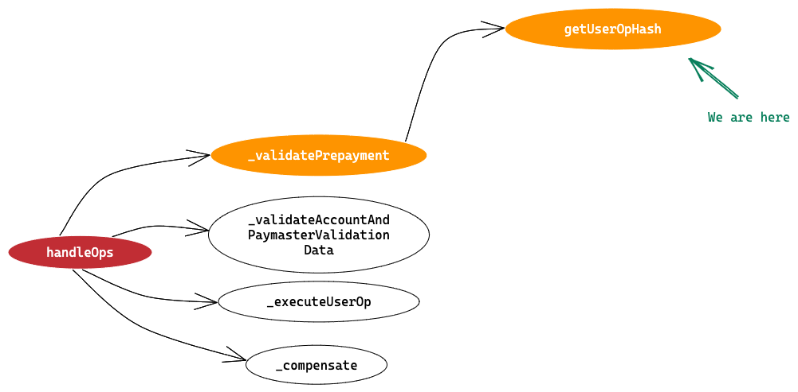
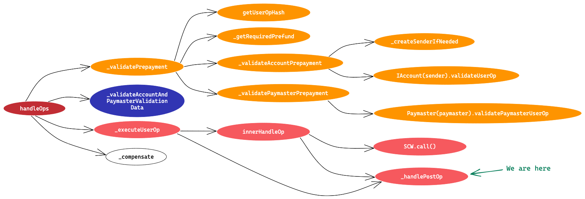

# Decoding EntryPoint and UserOperation with ERC-4337 Part 2

This is Part-2 of our series on decoding EntryPoint and UserOps with ERC-4337. For introduction & basic definitions, [please check out part-1](/blog/decodingentrypointpart1).

This part will dive deeper into the line by line code and transaction flow.

## Decoding EntryPoint code line by line

:::tip

While going through this explanation i recommend you open the EntryPoint code in another tab/screen to compare the actual code to this explanation. Here is the code [Github link](https://github.com/eth-infinitism/account-abstraction/blob/develop/contracts/core/EntryPoint.sol).

:::

Before proceeding lets make a mental image of all the methods are going to be called and their call hierarchy.

```
├─ handleOps
└─├──  _validatePrepayment
  │    ├──  getUserOpHash
  │    ├──  _getRequiredPrefund
  │    ├──  _validateAccountPrepayment
  │    │    ├──  _createSenderIfNeeded
  │    │    └──   IAccount(sender).validateUserOp
  │    │
  |    ├──  _validateAndUpdateNonce
  │    └──  _validatePaymasterPrepayment
  │         └── Paymaster(paymaster).validatePaymasterUserOp
  │
  ├──  _validateAccountAndPaymasterValidationData
  ├──  _executeUserOp
  │    ├──  innerHandleOp
  │    │    ├──  SCW.call()
  │    │    └──  _handlePostOp
  │    └──  _handlePostOp
  └──  _compensate

```

The first point of interaction with EntryPoint is `handleOps` method. This method is called by Bundlers to execute a bundle of UserOperations.

## hanldeOps method

### We are here

You’ll find more “We are here” sections, that will help you visualise where in the call hierarchy you are right now in EntryPoint contract. We are starting with handleOps method which is the entry point method, so we see only this method in the image. In next sections you’ll see more method calls branching out of handleOps method.


### Function decleration

```

function handleOps(UserOperation[] calldata ops, address payable beneficiary) public nonReentrant

```

This is a public function with nonReentrant modifier(to prevent reentrancy attacks) that accepts two parameters:

`UserOperation[] calldata ops` ⇒ Array of UserOperation objects with `calldata` storage.

`address payable beneficiary` ⇒ Beneficiary address where the gas is refunded after execution. This can be any address where bundler wants to receive the refund.

:::note

`handleOps` is called by the bundler account and if bundler send this transaction in public mempool on blockchain validator node, anyone can frontrun this transaction and change the beneficiary address so front runner can get the refund of this transaction.
So it’s important for bundler to send these transaction via private RPC to node providers or Block Builders so it doesn’t end up in public mempool.

:::

### Function Definition

```
uint256 opslen = ops.length;                               // Get the length of UserOperation array passed
UserOpInfo[] memory opInfos = new UserOpInfo[](opslen);    // Create array of UserOpInfo type of same length as UserOperation array

```

We are inside => handleOps

Above lines are self explanatory. We define an array of UserOpInfo type of same length as of UserOperation array. So we can see that for each UserOperation there is a UserOpInfo object that we can access.

Proceeding to next lines of code,

```
unchecked {
	for (uint256 i = 0; i < opslen; i++) {

	    UserOpInfo memory opInfo = opInfos[i];

	    (uint256 validationData, uint256 pmValidationData) = _validatePrepayment(i, ops[i], opInfo);

	    _validateAccountAndPaymasterValidationData( i, validationData, pmValidationData, address(0) );
	}

```

We are inside => handleOps

Here an unchecked block is started (it’s closed at the end of the method) and we start a for loop that will iterate over each UserOp object. In each iteration,

1. We get the UserOpInfo object at same index position as current UserOp object in their corresponding array. At this point this object is completely empty.
2. We call an internal method `_validatePrepayment`, that takes the for loop index, UserOp object and UserOpInfo object as input parameter and returns two validation data fields. First one corresponds to validation data for SCW and other one for Paymaster.
3. Now we call another internal method `_validateAccountAndPaymasterValidationData` whose purpose is to validate the validation data we got in step 2 above.

```
	uint256 collected = 0;
	emit BeforeExecution();

	for (uint256 i = 0; i < opslen; i++) {
	    collected += _executeUserOp(i, ops[i], opInfos[i]);
	}
} // Closing Unchecked block.

```

We are inside => handleOps

A BeforeExecution() event is emitted to mark the flow where any event emitted before this event, is part of the validation.

For each UserOp, an internal function `_executeUserOp` is called which internally calls the SCW and do the actual execution (calling a dapp smart contract or transferring funds to other address etc) and also calls postOp method on Paymaster if paymaster info is available in UserOp.

It returns the total gasFee for this UserOp that needs to be refunded to the beneficiary.

This happen for each UserOperation, and the fee refund for each UserOp is accumulated in collected variable, which will contain the total gas fee refund to be given to beneficiary for all the UserOp.

Next,

```
_compensate(beneficiary, collected);

```

We are inside => handleOps

At last, `_compensate` method is called. It’s a very simple function which just transfer the collected amount of native currency to the beneficiary address. Nothing else happens in this method.

### Pseudo Code

Here is a simple pseudo code for you to understand what exactly is happening in handleOps method.

Pseudo code for `handleOps` function:

1. Take the length of `userOps` as `n`.
2. Create a `UserOpInfo` array of length `n`.
3. For each user operation (**Verification Loop**):
   1. Call `_validatePrepayment(index, userOp, userOpInfo)`, which returns `validationData` and `paymasterValidationData`.
   2. Call `validateAccountAndpaymasterValidationData(index, validationData, pmValidationData, address(0))`.
4. For each user operation (**Execution Loop**):
   1. Call `_executeUserOp(index, userOp, userOpInfo)`, which returns the gas fee to be refunded to `beneficiary`.
   2. Sum all the fee refunds for each user operation.
5. Compensate the `beneficiary` address with all the collected gas fee.

### Summary

To make it easier to understand, there are four main method calls that occur in handleOps:

1. validatePrepayment
2. validateAccountAndPaymasterValidationData
3. executeUserOp
4. compensate

We are here


Now that we have simple idea of 4 methods that are being called from handleOps method, let’s see what’s happening inside each method

## validatePrepayment method

We are here


### Function Declaration

```

function _validatePrepayment(uint256 opIndex, UserOperation calldata userOp, UserOpInfo memory outOpInfo)
    private returns (uint256 validationData, uint256 paymasterValidationData) {

```

We are inside ⇒ handleOps > validatePrepayment

Remember this function is being called from the Verification Loop in hanldeOps method, so

1. First parameter is the index of the for loop happening in handleOps
2. Second parameter is the UserOp object itself
3. Third parameter is UserOpInfo object. This is an empty object. It’ll be initialised in this method.

Returns,

validationData ⇒ validation data returned by Smart Contract Wallet `validateUserOp` method

paymasterValidationData ⇒ validation data returned by Paymaster `validatePaymasterUserOp` method

### Function Definition

This function has below responsibilities,

1. Create and Initialise [MemoryUserOp](https://www.notion.so/c9589d072041413486d2caef49260f9f?pvs=21) type object
2. Deploy new SCW if needed
3. Validate account and paymaster data (if defined)
4. Perform some gas fields validation logic
5. Initialise UserOpInfo type object `outOpInfo`

Let’s start with the code

```

uint256 preGas = gasleft();

MemoryUserOp memory mUserOp = outOpInfo.mUserOp;

_copyUserOpToMemory(userOp, mUserOp);

outOpInfo.userOpHash = getUserOpHash(userOp);

```

In first line the on chain gas tracking is started. We get the amount of gas left at the start of the method.

Next, we are taking the mUserOp field from the userOpInfo object.

Then we initialise the mUserOp object using values from userOp. [Check here](https://www.notion.so/c9589d072041413486d2caef49260f9f?pvs=21) to see how it is done visually.

Next we calculate userOpHash field.

We are here



In actual code there are internal method calls that happens to get userOpHash but here we’ll just combine all method calls and present a simple code to see how userOpHash is calculated

```

function getUserOpHash(
    UserOperation calldata userOp
) public view returns (bytes32) {
    bytes32 memory hash = keccak256(pack(userOp));
    return keccak256(abi.encode(hash, address(this), block.chainid));
}

function pack(
    UserOperation calldata userOp
) internal pure returns (bytes memory ret) {
    //lighter signature scheme. must match UserOp.ts#packUserOp
    bytes calldata sig = userOp.signature;
    // copy directly the userOp from calldata up to (but not including) the signature.
    // this encoding depends on the ABI encoding of calldata, but is much lighter to copy
    // than referencing each field separately.
    assembly {
        let ofs := userOp
        let len := sub(sub(sig.offset, ofs), 32)
        ret := mload(0x40)
        mstore(0x40, add(ret, add(len, 32)))
        mstore(ret, len)
        calldatacopy(add(ret, 32), ofs, len)
    }
}

```

We are inside ⇒ handleOps > validatePrepayment > getUserOpHash

The `pack` function is an internal function that takes a UserOperation object and returns a `bytes array.` It does this by copying the UserOperation object from calldata up to, but not including, the `signature` field. It then returns this data as a `bytes array`.

The purpose of this function is to create a lighter representation of the UserOperation object that can be more efficiently passed around in memory.

Next,

```

// validate all numeric values in userOp are well below 128 bit, so they can safely be added
// and multiplied without causing overflow
uint256 maxGasValues = mUserOp.preVerificationGas |
    mUserOp.verificationGasLimit |
    mUserOp.callGasLimit |
    userOp.maxFeePerGas |
    userOp.maxPriorityFeePerGas;
require(maxGasValues <= type(uint120).max, "AA94 gas values overflow");

```

We are inside ⇒ handleOps > validatePrepayment

The bitwise OR operation (**`|`**) combines some userOp values by setting each bit in the result to 1 if the corresponding bit is set in any of the input values. This means that the resulting **`maxGasValues`**
variable will contain a value that is a combination of all of the specified gas limits and fees.

Here, the code checks that all numeric values in the `userOp` object are below 128 bits, so that they can be safely added and multiplied without causing an overflow error.

Next,

```

uint256 gasUsedByValidateAccountPrepayment;
uint256 requiredPreFund = _getRequiredPrefund(mUserOp);

```

We are inside ⇒ handleOps > validatePrepayment

Here we defined a variable `gasUsedByValidateAccountPrepayment` that we’ll initialise in next lines, and we calculate `requiredPreFund` by calling `_getRequiredPrefund(mUserOp)` method.

Before we understand what `_requiredPreFund` is we need to understand that one of the responsibilities of EntryPoint is to ensure that bundler is paid back the gas fee used to execute UserOperations. Now the question is who pays this gas to bundler. This is either paid by Paymaster or Smart Contract Wallet itself.

In order to do that, Paymaster or SCW are expected to do a deposit of ether (or native currency of the blockchain) on EP contract and then EP uses this deposit to pay back the bundler.

Now that we understand this, let’s come back to `_requiredPreFund` calculation. It is the max amount of gas fee that is pre deducted from Paymaster/SCW deposit on EP to ensure that EP has enough deposit to pay back the bundler. Later if the actual gas cost comes out to be less than the requiredPreFund, excess amount is given back to the EP deposit.

```
function _getRequiredPrefund(MemoryUserOp memory mUserOp) internal pure returns (uint256 requiredPrefund) {
    unchecked {
        // when using a Paymaster, the verificationGasLimit is used also to as a limit for the postOp call.
        // Our security model might call postOp eventually twice
        uint256 mul = mUserOp.paymaster != address(0) ? 3 : 1;
        uint256 requiredGas = mUserOp.callGasLimit +
            mUserOp.verificationGasLimit *
            mul +
            mUserOp.preVerificationGas;

        requiredPrefund = requiredGas * mUserOp.maxFeePerGas;
    }
}


```

We are inside ⇒ handleOps > validatePrepayment > \_getRequiredPrefund


We all know how to calculate gas fee using the formula `GasFee = GasPrice * GasUsed`

Here the gasPrice part is calculated from `mUserOp.maxFeePerGas` because we are trying to calculate the maximum fee that can be deducted from EP deposit.

And the gasUsed part is calculate using the formula

`callGasLimit + verificationGasLimit * (3 in case of Paymaster or 1 in absense of Paymaster)  + preVerificationGas`

:::info

These Gas Limits are all coming from UserOperation object passed from outside. And now you should know that why we can’t just pass a very high number in these fields to avoid OOG(Out Of Gas) errors. Because higher values would mean high gas fee pre deducted from the deposit on EP, and even if the deposit would be enough to cover the actual gas fee, your transaction would revert here.
So this is actually a challenge for clients when generating these gasLimit values for UserOperation to be just enough to avoid out of gas errors and not put too high values.

:::

Next,

```
(gasUsedByValidateAccountPrepayment, validationData)
	= _validateAccountPrepayment(opIndex, userOp, outOpInfo, requiredPreFund);

```

We are inside ⇒ handleOps > validatePrepayment

We are here


This step is the validation step done on Smart Contract Wallet, summary of this method is mentioned below.

1. First the smart contract wallet is created using userOp.initCode if the wallet is not deployed already.
2. If SCW pays for gas, it checks if wallet deposit on EP is enough to pay for the gas (`requiredPrefund` calculated above), if not it calculate missingAccountFunds.
3. Call validateUserOp on SCW, it will return a validationData field.
4. Again check if wallet deposit on EP is enough to pay for the gas (coz in validateUserOp call in step 3, wallet might have deposited missing funds)
5. If funds are still not enough, it reverts.
6. Else it decrement account deposit and calculate total gas used by this method.
7. Returns total gas used by this method and validationData returned in step 3.

```
/**
 * Call account.validateUserOp.
 * Revert (with FailedOp) in case validateUserOp reverts, or account didn't send required prefund.
 * Decrement account's deposit if needed
 */
function _validateAccountPrepayment(
    uint256 opIndex,
    UserOperation calldata op,
    UserOpInfo memory opInfo,
    uint256 requiredPrefund
)
    internal
    returns (
        uint256 gasUsedByValidateAccountPrepayment,
        uint256 validationData
    )
{
    unchecked {
        uint256 preGas = gasleft();
        MemoryUserOp memory mUserOp = opInfo.mUserOp;
        address sender = mUserOp.sender;
        _createSenderIfNeeded(opIndex, opInfo, op.initCode);
        address paymaster = mUserOp.paymaster;
        numberMarker();
        uint256 missingAccountFunds = 0;
        if (paymaster == address(0)) {
            uint256 bal = balanceOf(sender);
            missingAccountFunds = bal > requiredPrefund
                ? 0
                : requiredPrefund - bal;
        }
        try
            IAccount(sender).validateUserOp{
                gas: mUserOp.verificationGasLimit
            }(op, opInfo.userOpHash, missingAccountFunds)
        returns (uint256 _validationData) {
            validationData = _validationData;
        } catch Error(string memory revertReason) {
            revert FailedOp(
                opIndex,
                string.concat("AA23 reverted: ", revertReason)
            );
        } catch {
            revert FailedOp(opIndex, "AA23 reverted (or OOG)");
        }
        if (paymaster == address(0)) {
            DepositInfo storage senderInfo = deposits[sender];
            uint256 deposit = senderInfo.deposit;
            if (requiredPrefund > deposit) {
                revert FailedOp(opIndex, "AA21 didn't pay prefund");
            }
            senderInfo.deposit = uint112(deposit - requiredPrefund);
        }
        gasUsedByValidateAccountPrepayment = preGas - gasleft();
    }
}

```

We are inside ⇒ handleOps > validatePrepayment > \_validateAccountPrepayment

Explanation of above code snippet:

1. First the on chain gas tracking is started.
2. We get `mUserOp` and `sender` from `opInfo` object. `opInfo` is the same UserOpInfo object whose type is [defined here](https://www.notion.so/c9589d072041413486d2caef49260f9f?pvs=21).
3. Next we call `_createSenderIfNeeded()` method to call Factory contract to deploy new SCW if it’s not already deployed.
4. Call `numberMarker()` method. This function is used as a checkpoint in the code. It adds a specific opcode in the flow, so that during off chain simulation we can get this while tracing the simulation call in bundlers.
5. Check if paymaster address is zero, this means that SCW is supposed to pay for the current UserOperation execution.
   1. Calls balanceOf() method defined in the EP to get the deposit balance of sender (SCW)
   2. Check if current deposit is enough to cover the max gas fee for this UserOperation.
6. Calls `validateUserOp` method on SCW. It uses `mUserOp.verificationGasLimit` as gas limit in this call. It pass (userOp, userOpHash, missingAccountFunds) as parameter to validateUserOp method.
7. It returns a validationData which is stored in the return variable `validationData`
8. If validateUserOp call fails, the whole operation reverts.
9. If SCW is paying for the gas fee, again the deposit is checked to see if it’s enough to cover the max gas fee for this operation. See the [explanation above](https://www.notion.so/c9589d072041413486d2caef49260f9f?pvs=21) to see why this is done again.
10. Finish the gas tracking and assigns the total gas used in this method in return variable `gasUsedByValidateAccountPrepayment`

Next,

```
if (!_validateAndUpdateNonce(mUserOp.sender, mUserOp.nonce)) {
    revert FailedOp(opIndex, "AA25 invalid account nonce");
}

// a "marker" where account opcode validation is done and paymaster opcode validation is about to start
// (used only by off-chain simulateValidation)
numberMarker();

bytes memory context;
if (mUserOp.paymaster != address(0)) {
    (context, paymasterValidationData) = _validatePaymasterPrepayment(
        opIndex,
        userOp,
        outOpInfo,
        requiredPreFund,
        gasUsedByValidateAccountPrepayment
    );
}

```

We are inside ⇒ handleOps > validatePrepayment


First, `_validateAndUpdateNonce` is called which takes `mUserOp.sender` and `mUserOp.nonce` as argument. It validate the nonce field and increment the value against sender address.

Note: Smart Contract Wallet is not supposed to handle the nonce field in validateUserOp method anymore as this is done in EntryPoint now.

```
function _validateAndUpdateNonce(address sender, uint256 nonce)
internal returns (bool) {
    uint192 key = uint192(nonce >> 64);
    uint64 seq = uint64(nonce);
    return nonceSequenceNumber[sender][key]++ == seq;
}

```

Explanation of above code snippet:

1. The nonce in EntryPoint is supposed to be a 2D nonce where both key and sequence number is represented by single uint256 value.
2. Here first 192 bits represents the key part and rest 64 bits represents sequence value.
3. For normal operations, key value will be 0 and sequence value is incremented sequentially.
4. That’s why here first key part is extracted by right shifting nonce value by 64 and casting value to uint192 and then sequence number is extracted by casting nonce value to uint64.
5. Then the stored sequence number is compared with the sequence number from input. If both matches, the stored value is incremented using post ++ operator.

Then the numberMarker() is used again. [(Explained here)](https://www.notion.so/c9589d072041413486d2caef49260f9f?pvs=21)

And if paymaster is present in UserOperation, an internal method `_validatePaymasterPrepayment` is called. Summary of this method is mentioned below.

1. Check if gas used by account validation is less than userOp.verificationGasLimit.
2. Check if paymaster deposit on EP is enough to cover the max gas fee for this UserOperation.
3. If not, whole operation reverts.
4. Else deduct the max gas fee from the paymaster deposit on EP.
5. Calls `validatePaymasterUserOp` on Paymaster. It will return a context object and validationData.
6. Here, context object is totally upto Paymaster to define. EP just pass this context to Paymaster later while calling postOp method.
7. If call in step 5 fails, whole operation reverts.

```
/**
 * In case the request has a paymaster:
 * Validate paymaster has enough deposit.
 * Call paymaster.validatePaymasterUserOp.
 * Revert with proper FailedOp in case paymaster reverts.
 * Decrement paymaster's deposit
 */
function _validatePaymasterPrepayment(
    uint256 opIndex,
    UserOperation calldata op,
    UserOpInfo memory opInfo,
    uint256 requiredPreFund,
    uint256 gasUsedByValidateAccountPrepayment
) internal returns (bytes memory context, uint256 validationData) {
    unchecked {
        MemoryUserOp memory mUserOp = opInfo.mUserOp;
        uint256 verificationGasLimit = mUserOp.verificationGasLimit;
        require(verificationGasLimit > gasUsedByValidateAccountPrepayment, "AA41 too little verificationGas");
        uint256 gas = verificationGasLimit - gasUsedByValidateAccountPrepayment;

        address paymaster = mUserOp.paymaster;
        DepositInfo storage paymasterInfo = deposits[paymaster];
        uint256 deposit = paymasterInfo.deposit;
        if (deposit < requiredPreFund) {
            revert FailedOp(opIndex, "AA31 paymaster deposit too low");
        }
        paymasterInfo.deposit = uint112(deposit - requiredPreFund);
        try
            IPaymaster(paymaster).validatePaymasterUserOp{gas: gas}(op, opInfo.userOpHash, requiredPreFund)
        returns (bytes memory _context, uint256 _validationData) {
            context = _context;
            validationData = _validationData;
        } catch Error(string memory revertReason) {
            revert FailedOp(opIndex, string.concat("AA33 reverted: ", revertReason));
        } catch {
            revert FailedOp(opIndex, "AA33 reverted (or OOG)");
        }
    }
}

```

We are inside ⇒ handleOps > validatePrepayment > \_validatePaymasterPrepayment

Explanation of above code snippet:

1. Get `mUserOp` object from opInfo. `opInfo` is the same UserOpInfo object whose type is [defined here](https://www.notion.so/c9589d072041413486d2caef49260f9f?pvs=21).
2. Check if gas used by [account validation](https://www.notion.so/c9589d072041413486d2caef49260f9f?pvs=21) is less than `userOp.verificationGasLimit`.
3. **By now this is understood that, `userOp.verificationGasLimit` value should cover at least the gas for account validation (including account deployment) and paymaster validation.**
4. Get the paymaster deposit from the `deposits` mapping in EP.
5. If paymaster deposit is not enough to cover the max gas fee, EP reverts.
6. Else deduct the max gas fee (`requiredPrefund`) from paymaster deposit in EP.
7. Call Paymaster `validatePaymasterUserOp` method. Pass `userOp.verificationGasLimit` as gas limit.
8. Pass (`userOp, userOpHash, requiredPrefund`) as arguments.
9. If Paymaster validation call fails, whole operation reverts.
10. Else return the context object and validation data returned by as returned by `validatePaymasterUserOp` call.

### Quick Recap

Ok take a deep breath, we have done most of the verification part till now. So far as part of UserOperation verification,

1. We called SCW.validateUserOp() which internally deploys the wallet if required.
2. We called called Paymaster.validatePaymasterUserOp()

Looks simple, right?

There are many small checks related to gas and deposits inside these methods. So the code might look long, but conceptually its just getting the verification done by SCW and Paymaster. Remember devil is in the details.

Just to remind you again the `handleOps` flow looks like this

1. validatePrepayment ← We are here
2. validateAccountAndPaymasterValidationData
3. executeUserOp
4. compensate

We are still at the first step `validatePrepayment`. Now let’s finish the rest of the part of this method.

Next,

```
unchecked {
    uint256 gasUsed = preGas - gasleft();

    if (userOp.verificationGasLimit < gasUsed) {
        revert FailedOp(opIndex, "AA40 over verificationGasLimit");
    }
    outOpInfo.prefund = requiredPreFund;
    outOpInfo.contextOffset = getOffsetOfMemoryBytes(context);
    outOpInfo.preOpGas = preGas - gasleft() + userOp.preVerificationGas;
}

```

We are inside ⇒ handleOps > validatePrepayment

We are here


Explanation of above code snippet:

1. We stop the on chain gas tracking.
2. Now we check if userOp.verificationGasLimit is able to cover the gas used so far.
3. If not, the whole operation reverts.
4. Else we proceed and fill out rest of the fields on UserOpInfo object.
5. `outOpInfo.prefund` is assigned the requiredPreFund value which is max gas fee deducted from the deposit on EP.
6. `outOpInfo.contextOffset` is assigned the offset of context object in memory. Remember context is the object returned by `Paymaster.validatePaymasterUserOp` call.
   So instead of assigning the whole context object, we just save its memory offset. So we don’t have to pass around this heavy context object while calling internal methods.
7. `outOpInfo.preOpGas` is assigned (Total gas used so far + `userOp.preVerificationGas`)

:::tip

As explained at the beginning, UserOpInfo.preOpGas will contain total gas used so far, it includes

1. The actual logic written in EntryPoint contract
2. Other gas units, which is
   a. Base gas fee(21000)
   b. Gas spent in calling the handleOps and it’s parameters
   c. Gas that will be used in later part of EntryPoint which can’t be tracked using gasleft() opcode. Will come back to this point again later in this article.

The second point can’t be tracked on chain, so we rely on userOp.preVerificationGas field and assume its value has covered these gas units.

:::

OK, the prePayment part is done, let’s move to the next method that is called from `handleOps` method.

Just to remind you again the `handleOps` flow looks like this

1. [validatePrepayment](https://www.notion.so/c9589d072041413486d2caef49260f9f?pvs=21) ← This is Done
2. validateAccountAndPaymasterValidationData ← We’ll begin with this method now
3. executeUserOp
4. compensate

## validateAccountAndPaymasterValidationData method

### Function Declaration

```
/**
 * Revert if either account validationData or paymaster validationData is expired
 */
function _validateAccountAndPaymasterValidationData(
    uint256 opIndex,
    uint256 validationData,
    uint256 paymasterValidationData,
    address expectedAggregator
) internal view {

```

We are inside ⇒ handleOps > validateAccountAndPaymasterValidationData

Remember this function is being called from the Verification Loop in `hanldeOps` method, so

1. First parameter is the index of the for loop happening in handleOps
2. Second parameter is the validation data returned by validateUserOp method on SCW
3. Third parameter is the validation data returned by validatePaymasterUserOp method on Paymaster
4. Fourth parameter is the expected aggregator address (This is out of scope for this article, and in our flow address(0) is passed from `handleOps`

This function doesn’t return anything, it just revert if any of the validation data is not valid.

### Function Definition

This is a very small function that just do some validations on the validationData passed to it. Now to understand it better lets go into this validationData we’ve been talking about. How does it look like.

You must have observed that the type of validationData is uint256 which is returned by both SCW and Paymaster.

As per this ERC, the `uint256 validationData` value returned by SCW or Paymaster, MUST be a packed value consisting of `authorizer`, `validUntil` and `validAfter` timestamps.

Above all three values are packed in a single uint256 value.

`authorizer` ⇒ 0 for valid signature, 1 to mark signature failure. Otherwise, an address of an `authorizer` contract. This ERC defines “signature aggregator” as `authorizer`.

`validUntil`  ⇒ 6-byte timestamp value, or zero for “infinite”. The UserOp is valid only up to this time.

`validAfter`  ⇒ 6-byte timestamp. The UserOp is valid only after this time.

It’s upto the SCW or Paymaster to defined these values depending on their own use case. If you are not using BLS wallet or signature aggregator contract, then you can just return 0 value. EP will handle 0 value as positive validation.


Let's start with the code

```

(address aggregator, bool outOfTimeRange) = _getValidationData(validationData);

if (expectedAggregator != aggregator) {
    revert FailedOp(opIndex, "AA24 signature error");
}
if (outOfTimeRange) {
    revert FailedOp(opIndex, "AA22 expired or not due");
}

// pmAggregator is not a real signature aggregator: we don't have logic to handle it as address.
// non-zero address means that the paymaster fails due to some signature check (which is ok only during estimation)
address pmAggregator;
(pmAggregator, outOfTimeRange) = _getValidationData(paymasterValidationData);

if (pmAggregator != address(0)) {
    revert FailedOp(opIndex, "AA34 signature error");
}
if (outOfTimeRange) {
    revert FailedOp(opIndex, "AA32 paymaster expired or not due");
}

```

We are inside ⇒ handleOps > validateAccountAndPaymasterValidationData

We are here


The code is self explanatory,

1. First the validationData is decoded into aggregator address and a boolean value which tells if `validUntil` and `validAfter` part of validationData is valid as per the `block.timestamp` or not.
2. If aggregator returned by SCW, doesn’t match with expectedAggregator, EP reverts.
3. Remember expectedAggregator is passed as address(0) from handleOps. So in this flow SCW just need to return 0 value.
4. If validUntil and validAfter are out of time range as per block.timestamp, EP reverts.
5. Step 1-4 is repeated for paymasterValidationData as well.
6. Only with one exception that if aggregator address is non-zero, EP reverts. So paymaster must return 0 value for this in `validatePaymasterUserOp` method.

:::note

Note that we are not doing any gas tracking in this function. So whatever gas is used here, needs to be accounted in userOp.preVerificationGas field. This value comes from outside and client calculates this value while building the UserOperation.

:::

OK, our second method in handleOps is also done. Let’s see where we are now.

`handleOps` flow looks like this

1. [validatePrepayment](https://www.notion.so/c9589d072041413486d2caef49260f9f?pvs=21) ← This is Done
2. validateAccountAndPaymasterValidationData ← This is Done
3. executeUserOp ← We’ll begin with this method now
4. compensate

## executeUserop method

### Function Declaration

```
/**
 * execute a user op
 * @param opIndex index into the opInfo array
 * @param userOp the userOp to execute
 * @param opInfo the opInfo filled by validatePrepayment for this userOp.
 * @return collected the total amount this userOp paid.
 */
function _executeUserOp(
    uint256 opIndex,
    UserOperation calldata userOp,
    UserOpInfo memory opInfo
) private returns (uint256 collected) {

```

We are insldue => handleOps > executeUserOp

Remember this function is being called from the Execution Loop in hanldeOps method. So

First parameter is the index of the for loop happening in handleOps
Second parameter is UserOperation to be executed.
Third parameter is object. In earlier part of code, this object has been initialised using values from userOp.
‍

Returns,

collected ⇒ the amount of gas fee that needs to be compensated to the beneficiary address passed in handleOps method. It corresponds to total gas fee used in verification and execution and any extra execution of given UserOperation.

:::note

This amount should be ≥ the gas fee paid by the bundler transaction to call handleOps() otherwise there’s no incentive for bundler to execute this UserOperation.

:::

We are here


### Function Definition

Main purpose of this function is to execute the UserOperation, as validation has been done already and take any action that needs to be done post execution. Let’s start with the code

```
uint256 preGas = gasleft();
bytes memory context = getMemoryBytesFromOffset(opInfo.contextOffset);

```

We are inside ⇒ handleOps > executeUserOp

1. First, the on chain gas tracking again starts.
2. We fetch the context object from the memory using `opInfo.contextOffset`. This context object was returned by Paymaster when we called validatePaymasterUserOp.
   Now we need to pass this object back to Paymaster after userOp execution, when we’ll call postOp method of Paymaster.

Next,

```
try this.innerHandleOp(userOp.callData, opInfo, context) returns (
    uint256 _actualGasCost
) {
    collected = _actualGasCost;
} catch {
    bytes32 innerRevertCode;
    assembly {
        returndatacopy(0, 0, 32)
        innerRevertCode := mload(0)
    }
    // handleOps was called with gas limit too low. abort entire bundle.
    if (innerRevertCode == INNER_OUT_OF_GAS) {
				//report paymaster, since if it is not deliberately caused by the bundler,
        // it must be a revert caused by paymaster.
        revert FailedOp(opIndex, "AA95 out of gas");
    }

    uint256 actualGas = preGas - gasleft() + opInfo.preOpGas;
    collected = _handlePostOp(
        opIndex,
        IPaymaster.PostOpMode.postOpReverted,
        opInfo,
        context,
        actualGas
    );
}

```

We are inside ⇒ handleOps > executeUserOp

Explanation of above code snippet:

1. It starts with a try-catch block where this calls an internal method `innerHandleOp` that does the actual execution of userOp.
2. `innerHandleOp` returns the actualGasCost for given userOp.
3. It’s interesting to see all the code in catch block. Let’s see what it is.
4. In case call to innerHandleOp reverts, code execution will come to this catch block. Here we need to know the failure reason in catch block.
5. The flow will come to catch block because of following reasons
   1. If OOG error comes during execution
   2. If paymaster `postOp` method reverts which called from `innerHandleOp` method.
6. Now in catch block, first the revertCode is extracted using assembly code.
   1. **`returndatacopy(0, 0, 32)`** copies 32 bytes of data from EP contract's memory starting at position 0 (which is where the returned data from the inner function call will be stored) to memory position 0
   2. **`innerRevertCode := mload(0)`** loads 32 bytes of data from the memory position 0 and stores it in the **`innerRevertCode`**variable.
7. If the revertCode matches with `INNER_OUT_OF_GAS`, EP reverts the operation.
   1. This `INNER_OUT_OF_GAS` can be emitted by OOG checks in case bundler didn’t pass enough gas limit while calling handleOps.
   2. But even a malicious paymaster can revert with the same error code and cause a bundler to think it is "internal" error. That’s why in this case bundler should report the paymaster if this happens.
8. If the revert reason is something else, then EP calls `_handlePostOp()` method with `IPaymaster.PostOpMode.postOpReverted` mode. We’ll come back to this method later.

Now let’s go inside innerHandleOp method and see what’s happening.


```
/**
 * inner function to handle a UserOperation.
 * Must be declared "external" to open a call context, but it can only be called by handleOps.
 */
function innerHandleOp(
    bytes memory callData,
    UserOpInfo memory opInfo,
    bytes calldata context
) external returns (uint256 actualGasCost) {
    uint256 preGas = gasleft();
    require(msg.sender == address(this), "AA92 internal call only");
    MemoryUserOp memory mUserOp = opInfo.mUserOp;

    uint callGasLimit = mUserOp.callGasLimit;
    unchecked {
        // handleOps was called with gas limit too low. abort entire bundle.
        if (gasleft() < callGasLimit + mUserOp.verificationGasLimit + 5000) {
            assembly {
                mstore(0, INNER_OUT_OF_GAS)
                revert(0, 32)
            }
        }
    }

    IPaymaster.PostOpMode mode = IPaymaster.PostOpMode.opSucceeded;
    if (callData.length > 0) {
        bool success = Exec.call(mUserOp.sender, 0, callData, callGasLimit);
        if (!success) {
            bytes memory result = Exec.getReturnData(REVERT_REASON_MAX_LEN);
            if (result.length > 0) {
                emit UserOperationRevertReason(opInfo.userOpHash, mUserOp.sender, mUserOp.nonce, result);
            }
            mode = IPaymaster.PostOpMode.opReverted;
        }
    }

    unchecked {
        uint256 actualGas = preGas - gasleft() + opInfo.preOpGas;
        //note: opIndex is ignored (relevant only if mode==postOpReverted, which is only possible outside of innerHandleOp)
        return _handlePostOp(0, mode, opInfo, context, actualGas);
    }
}

```

We are inside ⇒ handleOps > executeUserOp > innerHandleOp

1. First thing to notice here is that it is declared as external method to open a call context, but it can only be called by handleOps method.
2. It starts on chain gas tracking using `gasleft()` opcode.
3. Check if msg.sender is address of EntryPoint only, else reverts.
4. Then in unchecked block, it checks if gas left so far is less than `callGasLimit + mUserOp.verificationGasLimit + 5000`
   1. Here callGasLimit is the userOp.callGasLimit ⇒ gas limit used while calling SCW method to execute userOp.callData
   2. We add userOp.verificationGasLimit coz we are going to make a call to Paymaster postOp method where this value is used as gas limit.
   3. This 5000 value is there to protect against an edge-case where bundler crafted gas-limit can cause inner call (SCW call) to revert and still pay.
5. If step 4 is true, it revert with `INNER_OUT_OF_GAS` as revert reason.
6. Else we proceed to call SCW using userOp.callData. Here a library Exec is used to make this call. This is regular assembly code to call a destination with callData.
7. You can check Exec library [code here.](https://github.com/eth-infinitism/account-abstraction/blob/develop/contracts/utils/Exec.sol#L11)
8. If SCW call revert, the EP does’t revert but it just emits an event and initialise mode variable with value `IPaymaster.PostOpMode.opReverted`
9. This mode variable is passed as argument to \_handlePostOp method (called at the end of this method), for it to know from where it is being called.
10. Remember `_handlePostOp()` is also called from `_executeUserOp` method in the [catch block.](https://www.notion.so/c9589d072041413486d2caef49260f9f?pvs=21)
11. The last unchecked block, first calculate total gas used so far till this point.
12. It is calculated as total gas used in this method + all earlier gas used starting from handleOps call which is already captured in [opInfo.preOpGas](https://www.notion.so/c9589d072041413486d2caef49260f9f?pvs=21)
13. At last it calls \_handlePostOp.

Now let’s go inside `_handlePostOp` method and see what’s happening. This is the final internal method call in Execution Flow.

## \_handlePostOp method

:::note

Till here, SCW execution is completed and now we just need to make last call to Paymaster `postOp` method.

:::



This is a bit long function, so lets break down this in Function Declaration and Function Definition

### Function Declaration

```
function _handlePostOp(
    uint256 opIndex,
    IPaymaster.PostOpMode mode,
    UserOpInfo memory opInfo,
    bytes memory context,
    uint256 actualGas
) private returns (uint256 actualGasCost) {

```

We are inside ⇒ handleOps > executeUserOp > innerHandleOp > \_handlePostOp

`opIndex` ⇒ index in the user operation batch
`mode` ⇒ whether is called from innerHandleOp, or outside (postOpReverted)
`opInfo` ⇒ userOp fields and info collected during validation
`context` ⇒ the context returned in validatePaymasterUserOp
`actualGas` ⇒ the gas used so far by this user operation

### Function Definition

This method can be a bit hard to understand so let’s start to understand the code in chunks.

```
uint256 preGas = gasleft();
unchecked {
    address refundAddress;
    MemoryUserOp memory mUserOp = opInfo.mUserOp;
    uint256 gasPrice = getUserOpGasPrice(mUserOp);

```

We are inside ⇒ handleOps > executeUserOp > innerHandleOp > \_handlePostOp

This is the part where we calculate the userOp gas price.

1. It calculate the gasPrice to be used to calculate the final gas cost of this userOp.
2. `maxFeePerGas` and `maxPriorityFeePerGas` param are taken from userOp for this.
3. `gasPrice ← min(maxFeePerGas, maxPriorityFeePerGas + block.basefee)` Calculation is same as done in EIP-1559 for transactions.

Next,

```
address paymaster = mUserOp.paymaster;
if (paymaster == address(0)) {
    refundAddress = mUserOp.sender;
} else {
    refundAddress = paymaster;
    if (context.length > 0) {
        actualGasCost = actualGas * gasPrice;
        if (mode != IPaymaster.PostOpMode.postOpReverted) {
            IPaymaster(paymaster).postOp{ gas: mUserOp.verificationGasLimit} (mode, context, actualGasCost);
        } else {
            // solhint-disable-next-line no-empty-blocks
            try
                IPaymaster(paymaster).postOp{gas: mUserOp.verificationGasLimit} (mode, context, actualGasCost)
            {} catch Error(string memory reason) {
                revert FailedOp(opIndex, string.concat("AA50 postOp reverted: ", reason)
                );
            } catch {
                revert FailedOp(opIndex, "AA50 postOp revert");
            }
        }
    }
}

```

We are inside ⇒ handleOps > executeUserOp > innerHandleOp > \_handlePostOp

1. Then we check who is paying for the gas for this userOp, SCW or Paymaster. Then we assign a refundAddress accordingly.
2. If `context` object is not empty, we proceed to call `postOp` method on Paymaster.
3. If this call is coming from `innerHandleOp` method, it calls postOp method. Here we don’t care if postOp reverts or not. EP will still pay the bundler the gas fee for this userOp.
4. If this call is coming from `_executeUserOp` catch block, it calls postOp method.
   1. If postOp reverts this time, the whole operation reverts with proper revert reason (if available).
   2. If flow is coming here, that means postOp is already called once, and this is second time the postOp is called.

Next,

```
actualGas += preGas - gasleft();
actualGasCost = actualGas * gasPrice;
if (opInfo.prefund < actualGasCost) {
    revert FailedOp(opIndex, "AA51 prefund below actualGasCost");
}
uint256 refund = opInfo.prefund - actualGasCost;
_incrementDeposit(refundAddress, refund);
bool success = mode == IPaymaster.PostOpMode.opSucceeded;
emit UserOperationEvent(
    opInfo.userOpHash,
    mUserOp.sender,
    mUserOp.paymaster,
    mUserOp.nonce,
    success,
    actualGasCost,
    actualGas
);

```

We are inside ⇒ handleOps > executeUserOp > innerHandleOp > \_handlePostOp

1. At the end, it calculate the final gas cost of user operation.
2. It checks if the actual gas cost used is less than the requiredPrefund calculated very early in handleOps flow.
3. If yes, then it refund the excess gas cost in the EP deposit corresponding to refundAddress calculated earlier.
4. It emits UserOperationEvent event with all relevant information. The success field indicated if call to SCW was succeeded or not.

OK we are almost done with the whole handleOps flow. Lets see where we are now

`handleOps` flow looks like this

1. [validatePrepayment](https://www.notion.so/c9589d072041413486d2caef49260f9f?pvs=21) ← This is Done
2. validateAccountAndPaymasterValidationData ← This is Done
3. executeUserOp ← This is Done
4. compensate ← We’ll begin with this method now

## compensate method

We are here


## Function Data

```
/**
 * compensate the caller's beneficiary address with the collected fees of all UserOperations.
 * @param beneficiary the address to receive the fees
 * @param amount amount to transfer.
 */
function _compensate(address payable beneficiary, uint256 amount) internal {

```

We are inside ⇒ handleOps > \_compensate

This method is not called from any for loop in handleOps so there’s no index parameter.

1. First parameter is the beneficiary address where the EP should transfer gas fee from its deposit.
2. Second parameter is the amount of gas fee to be transferred to beneficiary.

### Function Definition

This is very simple and small method that just transfers the gas fee from EP deposits to beneficiary address.

Let’s check the code

```

require(beneficiary != address(0), "AA90 invalid beneficiary");
(bool success, ) = beneficiary.call{value: amount}("");
require(success, "AA91 failed send to beneficiary");

```

This code is pretty self explanatory,

1. It checks if beneficiary is not a zero address.
2. Then it transfers the gas fee in native currency of blockchain to the beneficiary.
3. It checks if the transfer was successful or not. If not, it reverts.

## And we are done!

Huh, let’s take a break. Grab a cup of coffee or whatever calm your mind.

This was a pretty long piece of code to understand. And it might take a lot of reading again to understand it end to end.

So I’d recommend you go through the EntryPoint contract code yourself now and try to make some other developer in your team understand this code.

## Quick Recap

If you have made it this far, it calls for a recap of some important concept again.

1. EntryPoint (EP) contract is the core contract in ERC-4337 which orchestrate the whole transaction flow of UserOperation by interacting with SCW Factory contract, SCW contract and Paymaster contract.
2. EP always have deposit in native token on the blockchain. If someone wants to pay gas in ERC20 tokens for UserOp then it needs to be handled in Paymaster or SCW. For example, in case SCW want’s to pay for the gas in ERC20 token, it needs to first convert those ERC20 to native token (by interacting with some DEX) and then deposit it on EP contract.
3. EP has handleOps method which is called by the bundler. Bundler can pass multiple UserOperation to this method and a beneficiary address where the gas refund goes from EP.
4. EP stores the gas deposited by either Paymaster or SCW. Based on the UserOperation fields it decides from which deposit it will refund the bundler(beneficiary) address.
5. EP does its best to calculate the actual gas used during the execution. But unfortunately it can’t track all of the gas used, so it relies on `UserOp.preVerificationGas` field to cover the untracked gas during the execution.
   1. So higher value of `preVerificationGas` means more profit for the Bundler.
6. `UserOp.maxFeePerGas` and `UserOp.maxPriorityFeePerGas` decides the gasPrice to be used by EP for calculate the bundler refund.
   1. So Bundler should try to send handleOps transaction with lower gas fee for actual `handleOps` transaction to make some profit.
