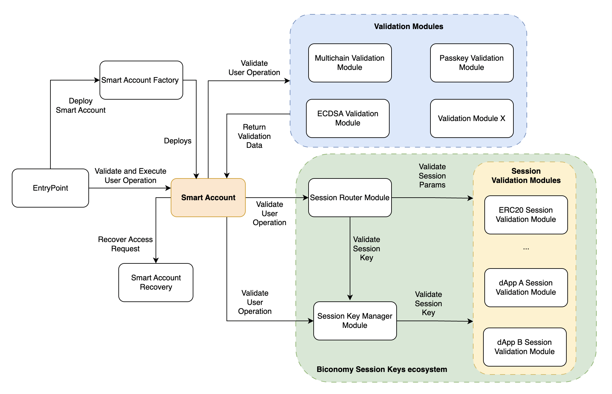
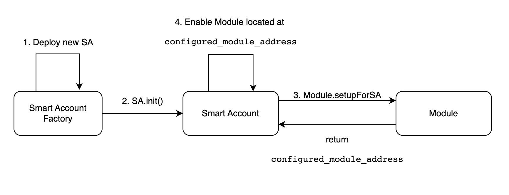
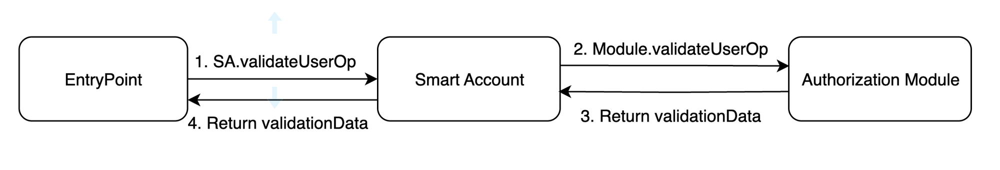
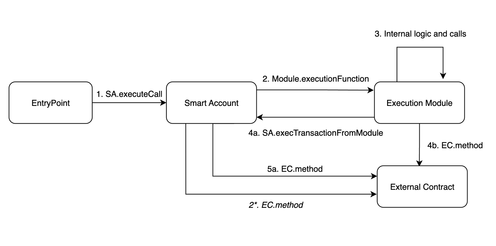
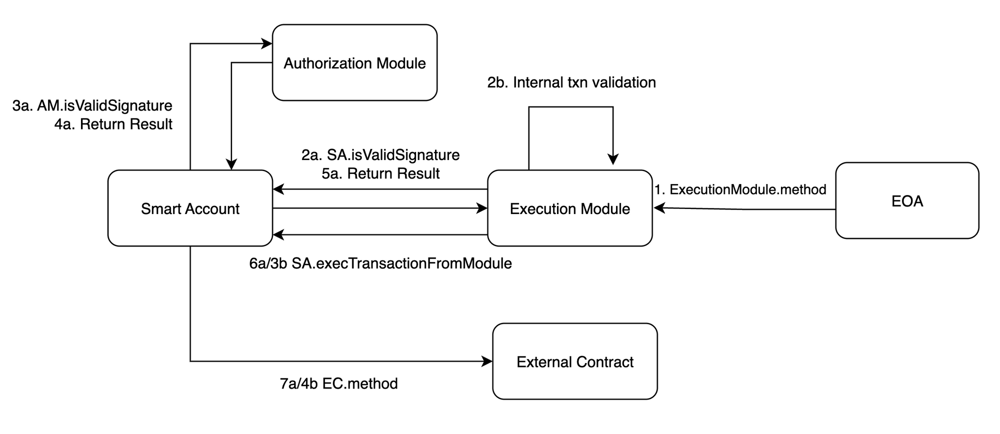

# Making Biconomy Smart Accounts Modular

With our new modular architecture, Biconomy is evolving Smart Account from wallet layer to a platform! The Smart Account Platform enables developers to easily & securely plug-in programmable modules to endlessly extend smart account capabilities. These modules leverage the power of Account Abstraction to allow for custom validation schemes and execution environments. This approach enables greater flexibility and customization for developers and end-users, opening up new possibilities for use cases in the blockchain space.

## Account Abstraction and Smart Contract Wallets

Smart Contract Wallets existed before Account Abstraction. Until recently it wasn’t rare to see SCW’s actually giving a worse user experience for mainstream users than that of EOAs.

Account Abstraction solves several problems that hindered the mass adoption of Web 3.

By simplifying transaction handling, enhancing security, improving flexibility and interoperability, and removing gas-paying limitations, it brings Web3 closer to mainstream users. It pushes the envelope for the future of blockchain technology. These features can only be achieved with programmable user accounts becoming EVM eco-system first-class citizens.

What does it mean for Smart Contract Wallets? It means SCWs can now become Smart Accounts: non-dependent on EOAs, agnostic to the encryption algorithm, recoverable, user friendly.

And now with Smart Accounts Platform, they become modular!

## Why is Modularity important?

TL;DR: It’s much easier to leverage all the potential of Account Abstraction with Modularity.

Modularity in EIP-4337 compatible Smart Accounts offers several key advantages that make them more adaptable, efficient, and future-proof.

Custom validation algorithms are one of the key features of AA. The possibility to sign transactions not only with the private key of the ECDSA-based EOA but with a passkey issued by your smartphone sounds tempting.

Session keys, which are, in fact, temporary private keys with customizable permissions and expiry time, are another way of authorizing user operations on behalf of a Smart Account owner.

Account recovery (in the form of social recovery or otherwise) is a reliable way of securely restoring access to the Smart Account, which is not available for EOAs.

Each of those features can be enabled in a given Smart Account implementation even without modularity.

However, what if a user wants to add newly designed validation schemes after the implementation was deployed? What if she wants to deactivate or completely remove some of the functionality for her Smart Account?

One way would be to upgrade to another implementation. However, there could be no implementation in existence that satisfies all the user’s requirements at the same time.

The modular approach brings users a convenient way of switching out, adding, or removing validation schemes and other functionality in their Smart Account.

To dApp builders, modularity allows shipping highly customizable Smart Contract Wallets (Smart Accounts) to their users. It unlocks seamless UX, eases integration and saves time and effort spent on development.

This is what makes modularity so powerful!

Instead of a one-size-fit-all wallet or accounts experience, devs can now customise their smart account implementation to enable the perfect UX for every user and every use case!

Biconomy Smart Account Platform is Modular

Biconomy SCW v1 was strongly inspired by Safe SCW. So it was modular from the very beginning.

With AA, the txn/userOp handling flow changed significantly. Now, the validation and execution phases are separated, which allows for building modules that contain validation-only or execution-only logic.

First attempts to use Modules for userOps validation have been made in Biconomy SCW v1. In this approach, if calldata field of a given userOperation implies, that during an execution phase a call to the method, that is located in one of the enabled modules, should be made, the validation is done via this module as well. After experimenting with this approach, we realized the power of modularity for validating user operations and decided to make modularity an important concept in Biconomy SCW v2 architecture.

Biconomy SCW v2 (Biconomy Smart Account Platform) takes modularity to a new level, making validation modules the only party that is able to validate user operations.

Biconomy Smart Account Platform Modular Architecture

With this Smart Account Platform, we are releasing

1. Smart Account implementation with modular architecture

2. Tons of modules (& a framework to add more in the future)

3. Improved Client SDK to access Smart Account Platform

‍

Below, we’ll give a brief overview of the most important engineering decisions that have been made for the Biconomy Smart Account Platform & the supporting modular architecture.

## Deploying a new Smart Account

Smart Account now doesn’t store ownership information in its own storage and has no default algorithm for validating signatures.

Thus it is ownerless by default.

To validate userOps it should have at least one validation module.

The Validation Module is a module that implements IAuthorizationModule interface. Implementing it allows a module to receive userOp data and return validation results back to the SmartAccount.

To ensure every Smart Account is able to validate userOps right after its deployment, the Biconomy Smart Accounts Factory contract configures and enables the first validation module at the time the new Smart Account is created.

Because of the requirements to use only Associated Storage during the validation phase set by ERC-4337, in most cases, the Module will return its own address as configured_module_address. However, if those requirements change it will be possible to build a ModuleFactory that deploys a new proxy instance of Module for every SA.

Any Module can be enabled as a first validation module. It can be the ECDSA Ownership Module, which mimics the behavior of the EOA-owned Smart Contract Wallets we are all used to and validates userOps based on the signature issued by a privileged EOA.

However, it can be a Passkey Module, that expects a cp256r1-compliant signature.

It can also be a Session Key Module. Or any other module that allows ensuring userOp has been initiated by a trusted party or just meets certain conditions like recurring payments.

With this approach Biconomy Smart Account achieves ****the key goal of account abstraction: allow users to use smart contract wallets containing arbitrary verification logic instead of EOAs as their primary account and completely remove any need at all for users to also have EOAs.

## Enabling Modules

Modules Management functionality is inherited by SmartAccount.sol from ModuleManager.sol. The former is in fact a modified version of Safe Module Manager, that has been adapted to the realities of AA. It follows the same way of storing data about enabled modules in a linked mapping. It means every next module enabled, links to the previous one.

The SENTINEL_MODULES with address 0x00…01 is used to mark the first and last items in the list.

0x00..01 ⇒ 0xa11ce

0xa11ce ⇒ 0xb0b

…

0xdeaf ⇒ 0xbeef

0xbeef ⇒ 0x00..01

Thus, the mapping is linked and it removes the need of having an additional array in case we want to iterate over enabled modules.

When a new module is enabled, it is added like this:

0x00..01 ⇒ 0xdecaf

0xdecaf ⇒ 0xa11ce

0xa11ce ⇒ 0xb0b

…

0xdeaf ⇒ 0xbeef

0xbeef ⇒ 0x00..01

Thus, Module Manager only stores information about whether a module is enabled or not.

There’s no categorization of modules, and also validation modules are not associated with specific execution functions.

It makes enabling a module easy and transparent.

## Validation

At validation phase `SmartAccount.validateUserOp` is called by `EntryPoint` . `EntryPoint` expects `validationData` to be returned.

`validationData` is made up of `validationResult`, `validUntil`, and `validAfter` once all three values are packed together into oneuint256.

Since Smart Accounts have no default validation method, `SmartAccount.validateUserOp` needs information about what module should be used for this `userOp` validation.

This information is packed in the `userOp.signature` field. We append the `moduleSignature` with the Validation Module address.

`SmartAccount.validateUserOp` extracts this address from `userOp.signature` and verifies if this address is an enabled module or not.

`moduleSignature` is a signature that should be processed by a module and made according to the requirements specified by the module that is expected to be processing it.

This approach is straightforward and flexible. It allows to have any amount of Validation Modules enabled. It also allows using any of them with any of the execution functions.

It is reliable as, despite the fact that any address can be appended by a malicious party to a signature as a module address, the validation flow will be forwarded only if this address is an enabled module.

This approach has a lot of upsides, however, downside is also present.

We will discuss it in the Hooks section of this article.

## Execution

There are two default execution functions in SmartAccount.sol

executeCall(address dest, uint256 value, bytes func)

and executeBatchCall(address[] dest, uint256[] value, bytes[] func)

They allow for open-ended execution that is required for AA-flow.

Additional execution functions can be implemented in Modules.

Diagrams below illustrate various execution flows for Modular Smart Accounts.

## Stateless Smart Accounts

A lot of discussion happened in AA community around storage patterns for Modular Smart Accounts.

We stick to the point, that purpose of Smart Accounts is to “store” and manage assets.Thus Modular Smart Account only needs its own storage to store information about modules.All operations made by SA should be managing the assets, and for this, there’s no need of using the SA’s storage.

Smart Account is something that can be used for years. With the upgradeability, that all the Smart Accounts feature, users can easily switch from one implementation to another to get new features, at the same time keeping the SA address unchanged. It is like you could change your Bank keeping your account number the same.

Logic is what makes Accounts smart. And it can easily be changed with the upgrade. The only source of potential upgrading issues is storage, which remains unchanged with every upgrade. The old storage layout can be incompatible with the new logic. That’s why to ensure seamless usage of a Smart Account in the future, it’s a good idea to keep its storage as clean as possible.

Biconomy Smart Account is almost stateless. There are two deprecated storage locations, that has been used in Biconomy SCW v1, but are not used anymore. The only active storage usage in v2 is the modules mapping in the Module Manager.

delegatecalls open endless possibilities to change Smart Account’s storage, that’s why we think that limiting them is a good idea.

Biconomy SA default execution functions mentioned above do not allow for delegatecalls.

The only place where delegatecalls are still present is execTransactionFromModule method. We kept it for consistency and compatibility with the Forward Flow in v2. We will be introducing an access control mechanism to further limit delegatecall usage by modules in the next versions. At this point, we encourage dapps and users to be very careful with enabling modules and signing txns that use delegatecalls.

To learn more about other approaches to Modularity, we recommend this article by Konrad Kopp. It contains extensive information regarding Modularity in the Account Abstraction. It compares various approaches to Modularity and provides links to additional materials on the topic.

## Modules 

Biconomy Smart Account Platform ships with a basic set of Modules that cover the most important use cases.

### ECDSA Validation Module

It’s a basic Validation Module, that allows EOAs to become authorized to sign userOps for the given Smart Account. In fact, it works exactly like a regular ownership system, just rebuilt as a Validation Module.

ECDSA Validation Module follows ERC-4337 Associated Storage rules, by storing ownership information in a smartAccountAddress ⇒ EOAOwner mapping.

ECDSA Validation Module is easy to use with MPC providers like Web3Auth to abstract EOA Private Key storage and management out and unlock the Web2-like experience by logging in by email.

It is EIP-1271 compatible, allowing Smart Accounts to sign Ethereum messages for logging into dApps.

### Passkey Authorization Module

Passkeys are a web2 concept to replace the normal username-password flow with passwordless web authentication. Most people use password-based sign-in and very less people opt for 2FA which makes it risky as it is the single point of failure. Using passkeys users only need to authenticate the device and the device will share a signature with the application which can authenticate the user.

The Passkey Validation Module is similar to ECDSA Validation Module but uses another cryptographic curve secp256r1 (instead of secp256k1 for ECDSA). In fact, both are using Elliptic Curves, however, traditionally it’s secp256k1 which is referred as ECDSA.

With passkeys, users can avoid having regular EOA at all. It effectively allows signing userOps with any passkeys’ compatible validation system, such as FaceId, etc.

Thus, developers can provide their users with Smart Accounts that have Passkeys (FaceId, Fingerprint etc.) as the only validation mechanism.

### Session Key Authorization Module

Session Keys are a powerful concept of temporary user-issued cryptographic keys, that are authorized to sign only a predefined set of operations. Thus passkeys are safe to be shared with dApps and other users to perform allowed operations on the user’s behalf.

It opens endless opportunities for dApps to significantly improve UX. Session Keys can be used in Web3 gaming, DeFi, DeSoc, and other areas to bring a Web2-like experience to Web3 without compromising security and self-custody.

With this in mind, we designed the Biconomy Session Key system to be flexible, extensible, and reliable.

It features a Session Key Manager Module that performs general checks: is Session Key enabled and not expired? If everything is valid, it forwards the Session Validation flow to one of the Session Validation modules. Those modules contain use case-specific logic to check if the Session Key that signed the userOp is authorized to perform actions, specified in the userOp.calldata field.

Session Key Manager Module can be enabled by just calling SA.enableModule method. SA.setupAndEnableModule method can be used to enable one or more session keys along with enabling the Session Key Module.

Session Validation modules do not need to be enabled. Every active Session Key is added (by an authorized user) to the Session Key Manager along with rich data about this session key. This data includes the permissions and the address of a Session Validation Module that should handle session validation for this Session Key.

Module, which allows validation of the Session Key signed userOps can be the ultimate module for some dApps. However, every dApp has its requirements and use cases. It makes it non-trivial to build a one-for-all Session Keys Module.

The modular approach to Session Keys separates the management of Session Keys and Session validation logic. It allows the quick creation of Session Validation Modules for any specific use case without touching the core Session Key Management logic.

Session Keys allow users to enjoy seamless experiences in DeFi and Web3 Gaming. For example, the player can issue a Session Key that allows gaming backend signing operation with in-game currency for the next 24 hours on her behalf. So player doesn’t need to distract from the gaming process and approve every transaction.

The modular Session Key approach allows developers to easily build new or customize existing Session Validation Modules to let users issue Session Keys with a set of configuration options that are specific to their dApp.

You can read more about the Biconomy Modular Session Keys ecosystem and learn how to build your own Session Validation Module [here](/blog/smartaccountmodules_sessionkeys).

## Batch Session Router

Batch Session Router adds composability to the Session Keys ecosystem, allowing batching of several session key signed operations which should be validated by different Session Validation modules into one User Operation and execute them atomically.

You can read more about this module [here](/blog/smartaccountmodules_batchedsessionrouter).

## Multichain Validation Module

It allows a dApp to require just one signature from their user to configure & deploy smart accounts on multiple chains and delegate certain actions with permission via session keys on all those chains.

The Biconomy Multichain Validator module significantly improves UX for deploying and setting up Smart Accounts on several chains.

It allows for a user to only sign once and authorize any amount of userOps with this signature.

You can read more about this module, how it works, and how it helps dApp improve UX [here](/blog/smartaccountmodules_multichainvalidation).

## Account Recovery Module 

Vitalik described the need for Social Recovery in [this article](https://vitalik.ca/general/2021/01/11/recovery.html) more than two years ago. However, until recent times it was the choice of SCW developers whether to enable Account Recovery or not. For EOA, social recovery is not possible by its nature.

With Biconomy Modular Smart Account users can now choose whether they want to enable Account Recovery as a module or not.

The Account Recovery flow is the following:

User sets guardians and security delay when enabling Account Recovery Module
When a user wants account recovery, the recovery request is built depending on the module that stores ownership info (ECDSA module or Passkey module etc.)
The user informs guardians and they sign the Recovery Request.
The Request is submitted to the Account Recovery Module smart contract (via userOp).
If the security delay is set to 0, and all the signatures are valid, the request is executed immediately.
If the delay is not 0, the request is recorded on-chain and will require another userOp (which can be sent by anyone as it doesn't even require any signature) to execute it after the delay has passed. This 2nd userOp won't be validated before the delay has passed.
The design of the Biconomy Account Recovery Module is highly inspired by the above-mentioned Vitalik’s article.

## Release 

[GitHub repository](https://github.com/bcnmy/scw-contracts/tree/SCW-V2-Modular-SA) for Biconomy Smart Account Platform.

- [SmartAccount.sol](https://github.com/bcnmy/scw-contracts/blob/SCW-V2-Modular-SA/contracts/smart-account/SmartAccount.sol)
- [ECDSA Ownership Module](https://github.com/bcnmy/scw-contracts/blob/SCW-V2-Modular-SA/contracts/smart-account/modules/EcdsaOwnershipRegistryModule.sol)
- [Passkey Module](https://github.com/bcnmy/scw-contracts/blob/feat-ownerless-passkey-module/contracts/smart-contract-wallet/modules/PasskeyRegistryModule.sol)
- [Session Key Manager Module](https://github.com/bcnmy/scw-contracts/blob/SCW-V2-Modular-SA/contracts/smart-account/modules/SessionKeyManagerModule.sol) and [Session Validation Modules](https://github.com/bcnmy/scw-contracts/tree/SCW-V2-Modular-SA/contracts/smart-account/modules/SessionValidationModules).
We’re proud of our extensive test specs suite that showcases how Biconomy Smart Account works. We suggest starting with the [Smart Account Basics](https://github.com/bcnmy/scw-contracts/blob/SCW-V2-Modular-SA/test/smart-account/SA.Basics.specs.ts) spec.

Biconomy Modular SDK with full support for the Biconomy Modular Smart Account will be released soon.

## Audit

Biconomy Modular Smart Account has been audited by the Zellic and Kawach teams.