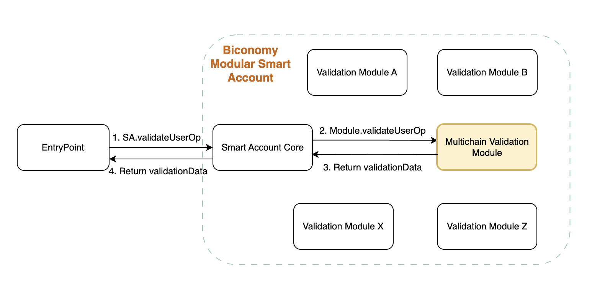
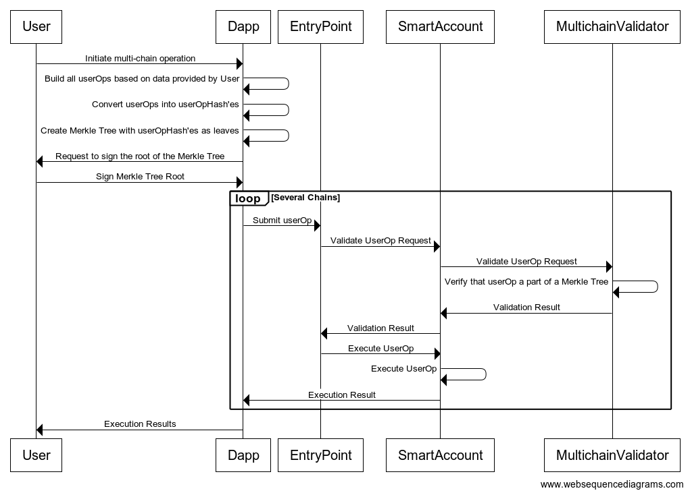

# Smart Account Modules - Multchain Validation Module - sign once, execute on multiple chains

For the past couple months we have been working on modules that enhance the functionalities of Smart Accounts. The latest game changing release is multichain validation module!

It allows a dApp to require just one signature from their user to configure & deploy smart accounts on multiple chains AND delegate certain actions with permission via session keys on all those chains.

‍
For dApps & wallets that are active on multiple chains & roll-ups, this will drastically reduce the number of pop-ups for your users!

Let's diver deeper into what's multi-chain validation, why we need it, what it enables and the technical implementation!

## Introduction

We already have too many chains to navigate web3. And with the imminent adoption of roll-ups and L2s, this isn’t going to stop. As Vitalik mentioned in his post on [the three transitions](https://vitalik.ca/general/2023/06/09/three_transitions.html) happening in Web3 right now, users are going to exist on lots of L2s & roll-ups.

‍

This is great for scalability and being ready for adoption!

‍

But it’s not ideal for the user experience. It means having to create and maintain wallets on each network, bridging funds and tons of other friction points. Thus, it’s important for the Web3 infrastructure builders to ensure seamless cross-chain UX for their customers.

One of the solutions to the overall web3 UX problem, also emphasised by Vitalik as one of the three transitions, is moving from EOAs to Smart Accounts (or Smart Contract Wallets). Biconomy is at the forefront of this transition pioneering Modular Smart Accounts development.

Smart Accounts can solve a lot of the cross-chain UX problems. But one big pain point still remained - setting up these smart accounts on all the different networks. And the need for constant signature to validate actions on every network.

‍

That’s something we at Biconomy have been working on for the last month with our partners at [Rage.trade](https://www.rage.trade/).

‍

Biconomy's latest development in this area is the Multichain Validator module which significantly reduces user friction for multichain operations.

## What it enables

Biconomy’s Multichain Validator module enables use cases which require several actions to be authorized for several chains with just one signature required from user.

‍

Basically it enables Sign once, Execute on multiple chains use case.

‍

This approach works best for actions which are same in nature but vary with some details from chain to chain.

Let’s take a real use case which inspired us to build such a module.

Let’s assume there is a dApp that helps users manage their crypto investments. It does it in a way, that when user comes to the platform, she allows dApp to perform some operations on her behalf. To make this happen, dApp deploys a new Smart Account for the user and enables Session Keys for this smart account. So user can issue Session Keys and give them to the dApp, so dApp can perform only user-selected operations: like only protocol A and for not more than amount X. Now imagine user wants to invest on several chains. There are various protocols on various chains, and user may want to set various permission for the sessions keys on various chains. Also, user doesn’t have a Smart Account yet, so dApp wants to deploy the SA for user, and enable session keys for it.

To ensure best UX, dApp wants user to sign as less times as possible. It means, that we need to protect userOps on several chains with various calldata with as less signatures as we can, ideally with just one.

However, userOps on several chains may have various nonces, various gas values, and of course various chainIds packed into userOpHash. Don’t forget about calldata which varies from chain to chain depending on the session key permissions for this chain.

With Biconomy Multichain Validator module it is possible to protect any amount of such userOps build for various chains with just one signature!

## How it works

There is an efficient way to prove that a blob of data has been included in a list of trusted blobs without going over the entire list or even knowing the entire list. This is done using Merkle Trees.

### How do we use Merkle Tree here?

1. We take all the userOps which we need to sign.
2. We get userOpHash’es from those userOps.
3. Every userOpHash is now a leaf of a Merkle Tree.
4. Instead of signing several userOpHash’es separately, user signs one Merkle Root.
5. Now we can reliably prove on-chain that a userOp is a leaf of a tree whose root has been signed by an authorized user.

That’s exactly what we need. Now user can authorize any amount of userOps with just one signature over the Merkle Root of those userOps.

Every userOp is included into the leaf as userOpHash+validUntil+validAfter, so user can define various validity timeframes for userOps they want to authorize.

You can find the implementation of the Biconomy Multichain Validator module here. You may notice, that in theory, such an approach enables one signature experience not only for the several chains but generally for the several totally different userOps even on the same chain.

And this is true.

However, we expect this module to be less likely used in this way. It is because signing several userOps on the same chain involves knowing nonces for all the userOps in the Merkle tree in advance. Of course, it is easy to calculate those nonces by just incrementing. However, if even one userOp not from the tree will be created and processed between those from the tree, the userOp from the tree with the same nonce will become invalid.

So despite the fact that in theory this Validation module can be used as a general-purpose multi-userOp validator, it is most convenient and reliable to use it as a Multichain validator.

# UX Impact

Biconomy Multichain Validator module significantly improves UX for deploying and setting up Smart Accounts on several chains.

It allows for a user to only sign once and authorize any amount of userOps with this signature.

It reduces user friction for dApps which for example want to quickly and seamlessly deploy and configure Smart Accounts on several chains or issue session keys with the permissions that vary from chain to chain.

More use cases with web2 like UX can be enabled with the described module.

It also allows for a very simple devX, as the concept of signing a Merkle Tree of userOps instead of signing userOpHash’es for several chains one by one is straightforward and not overengineered, so even developers who just start their journey in the web3 won’t be confused with what happens in the module and why

## Security assumptions

Since user signs the Merkle tree root of userOps, there is trust needed to be placed into the dApp which creates this Merkle root. User should trust that dApp would not put the hash of a malicious userOp as one of the leaves. However even when user signs single userOp, she signs its hash, which is not human-readable. So the trust assumption is present even for the general ERC-4337 flow.

In both cases if user wants to verify what she is signing, it is required that she performs some operations on the original userOp(s) to check that what dApp proposes her to sign is actually the result of hashing an original userOp(s).

Thus the Multi userOp approach introduced by the described module does not introduce any additional security trade-offs compared to the vanilla ERC-4337 flow.

## Conclusion

With the Multichain Validation module described above we start building the tools for the rollup-centric transition described by Vitalik. Even this simple module significantly improves UX for deploying and setting up Smart Accounts on several chains. It can be used not only with Biconomy Smart Account, but with any Smart Account which follows the EIP-6900 interface for validation modules. We’re looking forward to build more tools which enable the best multi chain UX for the users of Biconomy-powered dApps.
