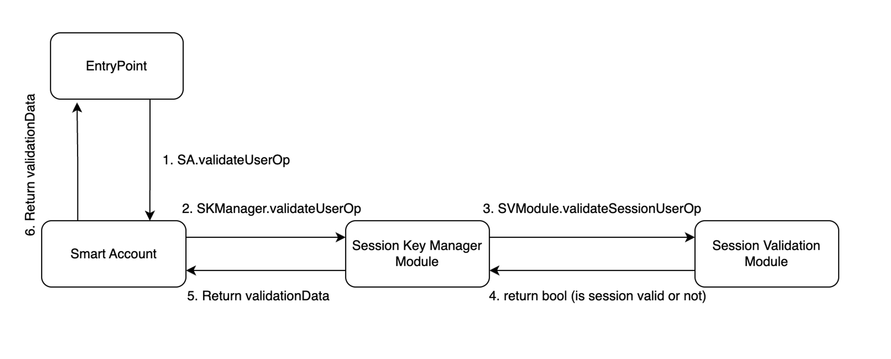
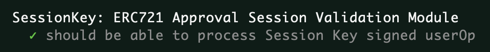

# Smart Account Modules - Session Keys

## Motivation

Session Keys open endless opportunities for dApps to significantly improve UX. Session Keys can be used in Web3 gaming, DeFi, DeSoc, and other areas to bring a Web2-like experience to Web3 without compromising security and self-custody.

However, every dApp or at least every category of dApps has its own requirements regarding what permissions users should be able to configure for a Session Key.

For dApps that deal with ERC-20 tokens, it can be

```
  struct ERC20SessionKeyParams {
    address token;
    uint48 validUntil;
    uint48 validAfter;
    address receiver
    uint256 maxAmountPerTransfer
}

```

For ERC-721 we would want to introduce an array of `tokenIds` that are allowed to be managed by this Session Key. In a more sophisticated case, we will want to specify a set of collection addresses and for every collection a set of `tokenIds`. In this case, the struct should have completely different fields.

Imagine, we have tens of such use cases (and it will end up like this since a lot of dApps can benefit from getting cryptographically secure temporary permissions to perform actions on behalf of users). It would be challenging to come up with a single contract that could efficiently identify which Session Key has which set of rules (permissions) and most importantly switch to the right algorithm to parse the data according to the required structure and check that a given userOp complies to this exact set rules.



The modular approach to Session Keys solves this issue. It separates Session Keys management and Session validation logic by moving validation of the params to separate smart contracts, called Session Validation Modules.

It allows for quick building of such Session Validation Modules for any specific use case without touching the core Session Key Management logic.

Session validation logic can be as complex as needed, since it is not now incorporated into one-fits-all Session Key Module, but lives in a separate module, that is triggered only when it is required.

## How it works

Let’s go through the Biconomy Session Key Manager and ERC20 Session Validation modules line by line to see how it works.

We start with the [Session Key Manager Module](https://github.com/bcnmy/scw-contracts/blob/SCW-V2-Modular-SA/contracts/smart-account/modules/SessionKeyManagerModule.sol).

Session Key Manager Module stores the information about enabled Session Keys and performs basic checks that are common for all the Session Keys despite of the use case they are intended to serve.

```
contract SessionKeyManager is BaseAuthorizationModule

```

Session Key Manager inherits BaseAuthorizationModule which sets the proper interface in order for the Session Key Manager Module to be able to validate ERC-4337 userOps.

```

struct SessionStorage {
    bytes32 merkleRoot;
}
...
mapping(address => SessionStorage) internal userSessions;

```

This mapping stores the information about which Session Keys are enabled for which Smart Account (the mapping `address` key). The mapping value is a `SessionStorage` object which is basically a root of a Merkle Tree containing the information about all the Session Keys that have been enabled for a given Smart Account along with the permissions.

Instead of a single bytes32 Merkle Root, we could have stored the nested address ⇒ `SessionStorage` mapping for every new session key. In this case, `SessionStorage` struct layout would have also changed.

The nested mapping approach is more straightforward, however, the Merkle Tree approach allows adding a new Session Key to consume less gas, as we always use the same 32 bytes warm slot instead of recording to a cold slot encoded by a mapping key.

As a trade-off Merkle Tree approach involves more off-chain work that needs to be done to re-calculate the Merkle Root for every new Session key to be added or existing to be removed.

The following `getSessionKeys` and `setMerkleRoot` methods are just respective getter and setter to access the `userSessions` mapping.

## validateUserOp

This is the main method that does all the job, and allows Session Key Manager Module to validate ERC-4337 user operations.

This method is called from `SmartAccount.sol` when Smart Account identifies userOp that should be validated via the Session Keys module.

The method receives `userOp` and `userOpHash`, both initially provided by an `EntryPoint`.

```

SessionStorage storage sessionKeyStorage = _getSessionData(msg.sender);

```

This line is self-explanatory. We just create a pointer to the SessionStorage object for the msg.sender, which is the Smart Account.

All the additional information, that needs to be verified by Session Module Manager is packed into the userOp.signature field. So we need to extract it.

```
 (bytes memory moduleSignature, ) = abi.decode(
    userOp.signature,
    (bytes, address)
);

```

This block just extracts the signature, that is intended to be processed by a module, by dividing it from an address, that is a module address and is used in the SmartAccount.sol itself to forward the validation flow to the module. Check [here](https://github.com/bcnmy/scw-contracts/blob/e1f7a1019f274d87df9452113ad8f6b74ec8909e/contracts/smart-account/SmartAccount.sol#L267-L276) for the reference.

The next block is more interesting

```
 (
    uint48 validUntil,
    uint48 validAfter,
    address sessionValidationModule,
    bytes memory sessionKeyData,
    bytes32[] memory merkleProof,
    bytes memory sessionKeySignature
) = abi.decode(
        moduleSignature,
        (uint48, uint48, address, bytes, bytes32[], bytes)
    );

```

In this code, we parse the `moduleSignature` to get the module-specific data from it.

`validUntil` and `validAfter` are the standard values that identify the window where userOp is valid. Used like this, they will identify the validity period for a Session Key and we won’t need to write additional code to validate those parameters. It will be done in the `EntryPoint`, as described below.

sessionValidationModule is an address of a Session Validation module that should be used to perform some use case-specific checks.

`sessionKeyData` is the data that will be passed to the `sessionValidationModule`

merkleProof is the proof required to verify the fact that a SessionKey with the given parameters is actually part of a Merkle Tree represented by `sessionKeyStorage.merkleRoot`.

And finally, `sessionKeySignature` is a userOpHash signed by a Session Key.

The next block makes verifies the Session Key with the parameters is actually enabled.

```

  bytes32 leaf = keccak256(
    abi.encodePacked(
        validUntil,
        validAfter,
        sessionValidationModule,
        sessionKeyData
    )
);
if (
    !MerkleProof.verify(merkleProof, sessionKeyStorage.merkleRoot, leaf)
) {
    revert("SessionNotApproved");
}

```

First, we construct a Merkle Tree leaf, that represents the Session Key (part of sessionKeyData and its parameters: `validUntil`, `validAfter`, `sessionValidationModule`, and the rest of `sessionKeyData`.

Then we verify this leaf is a part of a Merkle Tree represented by the `sessionKeyStorage.merkleRoot`. Read more about Merkle Trees and how they work in Solidity [here](https://soliditydeveloper.com/merkle-tree).

If the leaf is not a part of the tree, it means that whether the Session Key or one of its parameters is wrong, i.e. has not been enabled by Smart Account authorized party (since there’s no owner as such for a Modular Smart Account, we use the ‘authorized party’ term).

If the leaf is part of the tree, we proceed.

```
return
  _packValidationData(
      //_packValidationData expects true if sig validation has failed, false otherwise
      !ISessionValidationModule(sessionValidationModule)
          .validateSessionUserOp(
              userOp,
              userOpHash,
              sessionKeyData,
              sessionKeySignature
          ),
      validUntil,
      validAfter
  );

```

What is done first in this block, is that we apply `ISessionValidationModule` interface to the `sessionValidationModule` address and call `validateSessionUserOp` on it.

For our example, let’s use [ERC20 Session Validation Module](https://github.com/bcnmy/scw-contracts/blob/SCW-V2-Modular-SA/contracts/smart-account/modules/SessionValidationModules/ERC20SessionValidationModule.sol).

Let’s explore its `validateSessionUserOp` method, as it is being executed now.

## SessionValidationModule.validateSessionUserOp

It accepts \_op, which is basically the userOp, \_userOpHash, \_sessionKeyData , and \_sessionKeySignature.

What is happening then, is that the Session Validation Module actually parses this use case-specific data from a \_sessionKeyData. Each Session Validation module will have to make it in its own way as it operates with its own set of parameters.

```
address sessionKey = address(bytes20(_sessionKeyData[0:20]));

```

This by the way will most probably be common for all the Session Validation modules. Here, we extract the `sessionKey` identifier itself. In this case, it is a regular 160-bytes Ethereum address.

```
  address recipient = address(bytes20(_sessionKeyData[40:60]));
  uint256 maxAmount = abi.decode(_sessionKeyData[60:92], (uint256));
  {
      address token = address(bytes20(_sessionKeyData[20:40]));

```

Here, we decode the main ERC20 Transfer parameters: `recipient`, `maxAmount`, and `token`.

We are sure that exactly those parameters have been set by a Smart Account authorized party for this `sessionKey` as we already verified that a leaf, composed of not signed data, is, in fact, a part of a Merkle Tree represented on-chain by a Merkle Root.

Now, we just verify if the `_op.callData` parameters correspond to the allowed parameters. If everything is ok, we proceed, if not, revert.

Since `_op.callData` is in fact a call to the `token.transfer` method encoded into the call to the `SmartAccount.executeCall` method, we need to parse all the parameters from the dynamic bytes array using those magic values. We know those values because we know the exact layout of a standard ERC-20 token transfer calldata.

That’s why we need Session Validation Modules. For the ERC-721 transfer, we would need completely other values to decode the calldata.

Now, if all the parameters are ok, and execution hasn’t reverted yet, we come to the signature verification itself. Since our `sessionKey` is just an address, we can use the standard ECDSA recovery algorithm.

Note, that we use standard EOA public key and private key pair in this example. However, the session key can be any key pair, for example, it can be secp256r1 Passkey pair. So the session key can be easily issued by your iOS or Android device.

And the `validateSessionUserOp` function returns the bool value, which represents the result of comparing the expected `sessionKey` with an address that in fact signed the `userOpHash`.

Now, let’s return to `SessionKeyManager.validateUserOp` method

## validateUserOp again

If the Session Validation module returns `true`, that means, everything is right and what userOp tries to accomplish via its `callData` is allowed to be authorized with a Session Key, which was used to sign the `userOpHash` provided.

In this case, we have to pack 0 to the `validationData`, as 0 means signature validation has not failed.

If the Session Validation module returns `false` which means the signature provided is wrong, we need to pack `SIG_VALIDATION_FAILED` which is basically 1.

That’s we apply logical not operator (!) to the result that is returned from the Session Validation module.

So, we pack everything together with the validUntil and validAfter and return it to the EntryPoint, which will [validate](https://github.com/eth-infinitism/account-abstraction/blob/5e78f8635552e3c55fbced072056a77c8f1e8b75/contracts/core/EntryPoint.sol#L466-L484) this `validationData`.

Congrats, you made it! That’s how sessionKey signed userOp validation happens.

Before proceeding to the next section, we also suggest checking the [following test spec](https://github.com/bcnmy/scw-contracts/blob/SCW-V2-Modular-SA/test/module/SessionValidationModules/ERC20SessionValidation.Module.specs.ts) that showcases the usage of Session Keys modules in practice, including how this complex signature that contains a lot of additional parameters is built.

## Making a new Session Validation Module

Now, let’s try to build a new (very simple) Session Validation module step by step.

### Problem statement

Imagine, Bob contacted you and claimed he can sell your Bored Lady Penguins NFTs, so you can finally repay your mom. For this, all you need to do is to allow him to perform a `setApprovalForAll` operation on your NFTs.

However, you don’t trust him a lot, so you can’t transfer your precious NFTs to him, and there’s no other way of allowing him to do the approvals as if you perform `setApprovalForAll` setting Bob’s address as operator, he still won’t be able to re-approveForAll.

Luckily, you have not just an EOA, but a (very) Smart Account. All you need is to build a Session Validation module, that allows you to grant Bob temporary permission to `setApprovalForAll` for Bored Lady Penguins on behalf of your Smart Account.

## Let’s buidl

First, let’s clone the `ERC20SessionValidationModule.sol` and rename it to `ERC721ApprovalSessionValidationModule.sol` and also change the contract name to `ERC721ApprovalSessionValidationModule`.

Let’s think, what use cases specific parameters do we need to encode into the `_sessionKeyData`.

We still need to encode `sessionKey`. Imagine, we decide to use a regular EOA address as our session key public identifier, so let’s use the first 20 bytes for it.

We need to encode the NFT contract address, so our session key only allows Bob to manage our Bored Lady Penguins, not our Punkzukis. Let’s use the next 20 bytes for it.

We don’t know which marketplace will be the approved party, as Bob keeps this in secret. So we can’t set the `operator` parameter. We neither need to set any tokenId here.

So, we only have two specific parameters, which is great for our demo use case.

Let’s create the flow for decoding those parameters and checking `op.callData` against them.

```
// decode parameters
address sessionKey = address(bytes20(_sessionKeyData[0:20]));
address nftContract = address(bytes20(_sessionKeyData[20:40]));

```

Bob will still use SmartAccount.executeCall to perform a call on behalf of our Smart Account.

So, we know how to decode \_op.calldata.

```

(address tokenAddr, uint256 callValue, ) = abi.decode(
    _op.callData[4:], // skip selector
    (address, uint256, bytes)
);

```

Now let’s check that Bob tries to `setApprovalForAll` for our Bored Lady Penguins, not other NFTs.

We also don’t want him to send any value along with this call.

So we introduce the following checks:

```
if (tokenAddr != nftContract) {
    revert("ERC721SV Wrong NFT contract");
}
if (callValue > 0) {
    revert("ERC721SV Non Zero Value");
}

```

Then, let’s check it’s exactly `setApprovalForAll` function and that it sets `true` as approval status, as we don’t want to allow Bob to renounce our existing approvals.

For this, we need to parse the inner calldata, that will be used by `executeCall` when it will be called by an EntryPoint at the execution stage.

```
(bytes4 selector, bool approved) = _getApprovalForAllData(_op.callData[100:]);

  ...
  function _getApprovalForAllData(bytes calldata _approvalForAllCalldata)
          internal
          view
          returns (bytes4 selector, bool approved)
      {
          //first 32 bytes is the length of bytes array
          selector = bytes4(_approvalForAllCalldata[32:36]);
          //36:68 is the address of the operator
          approved = (uint256(bytes32(_approvalForAllCalldata[68:100])) == 1);
      }
```

Since we know, that setApprovalForAll has 2 arguments, we know that the bytes \_approvalForAllCalldata consists of 32 bytes for storing the calldata length, then there are 4 bytes for the function selector, then 32 bytes for address, then 32 bytes for bool.

We get the required info from the calldata and return it.

Now, we can perform checks.

```
if (selector != bytes4(0xa22cb465)) {
    revert("ERC721SV Not Approval For All");
  }
  if (!approved) {
    revert("ERC721SV False value");
  }

```

Where 0xa22cb465 is a setApprovalForAll selector.

And finally, we verify that the userOpHash was signed with the private key corresponding to the sessionKey and return the result, just like in the ERC20 case.

Check the full code for the module [here](https://github.com/bcnmy/scw-contracts/blob/2023-07-06_Tutorial-session-validation-module/contracts/smart-account/modules/SessionValidationModules/ERC721ApprovalSessionValidationModule.sol).

That’s it. Now, let’s test how it works.

## Test Case

Check the full test spec code [here](https://github.com/bcnmy/scw-contracts/blob/2023-07-06_Tutorial-session-validation-module/test/module/SessionValidationModules/ERC721ApprovalSessionValidation.Module.specs.ts).

I will comment only code snippets that are specific to this tutorial.

## Setup test environment

In the setupTests function we set up the test environment, which is common to all the test cases.

First, we need to deploy our ERC721 Approval Session Validation Module.

```
const erc721ApprovalSVM = await (await ethers.getContractFactory("ERC721ApprovalSessionValidationModule")).deploy();

```

Then we need to add a new Session Key to the Session Key Manager (it has already been deployed and enabled at this point).

```
const sessionKeyData = hexConcat([
  hexZeroPad(sessionKey.address, 20),
  hexZeroPad(mockNFT.address, 20),
]);
```

Here we fill our Session Validation module-specific data, which is only the sessionKey itself and our ERC-721 contract address.

```
const leafData = hexConcat([
  hexZeroPad(ethers.utils.hexlify(0),6),
  hexZeroPad(ethers.utils.hexlify(0),6),
  hexZeroPad(erc721ApprovalSVM.address,20),
  sessionKeyData
]);
```

Then we add other Session Key parameters: validUntil and validAfter (we put 0 for them here), and the address of our Session Validation Module, so Session Key Manager knows who is responsible for making use case-specific checks.

```
const merkleTree = await enableNewTreeForSmartAccountViaEcdsa(
    [ethers.utils.keccak256(leafData)],
    sessionKeyManager,
    userSA.address,
    smartAccountOwner,
    entryPoint,
    ecdsaModule.address
  );
```

Here we call a helper function enableNewTreeForSmartAccountViaEcdsa to add the leaf (session key and params) to the Merkle tree and upload the new Merkle root on-chain.

Now, let’s make the first test case.

## Positive Test Case

```

const { entryPoint, userSA, sessionKeyManager, erc721ApprovalSVM, sessionKeyData, leafData, merkleTree, mockNFT } = await setupTests();

```

Here we get the test environment objects.

Then we call a helper function makeEcdsaSessionKeySignedUserOp that makes a proper userOp and signs it with a sessionKey.

But let’s check what this function [does under the hood](https://github.com/bcnmy/scw-contracts/blob/2023-07-06_Tutorial-session-validation-module/test/utils/sessionKey.ts#L15-L65).

```
const txnDataAA1 = SmartAccount.interface.encodeFunctionData(
    functionName,
    functionParams
  );
```

First, it makes a userOp.calldata with the parameters provided. In our case parameters are:

```
functionName = "executeCall";
  functionParams = [
          mockNFT.address,
          0,
          Erc721.interface.encodeFunctionData("setApprovalForAll", [charlie.address, true]),
        ]
```

So it means EntryPoint will call SmartAccount.executeCall, which will call mockNFT.setApprovalForAll.

Then we just fill the rest of the fields for a userOp and sign it with a sessionKey.

It gives us a correct signature over the userOp that does what we specified in the calldata.

However, we need to pack plenty of additional parameters into our signature.

Here’s how we do it.

```
const paddedSig = defaultAbiCoder.encode(
    //validUntil, validAfter, sessionVerificationModule address, validationData, merkleProof, signature
    ["uint48", "uint48", "address", "bytes", "bytes32[]", "bytes"],
    [
      validUntil,
      validAfter,
      sessionValidationModuleAddress,
      sessionKeyParamsData,
      merkleProof,
      userOp.signature
    ]
  );
```

First, we pack all the session key parameters (general and specific) along with the signature.

This data is used by Session Key Manager and Session Validation modules.

```
const signatureWithModuleAddress = ethers.utils.defaultAbiCoder.encode(
    ["bytes", "address"],
    [paddedSig, sessionKeyManagerAddress]
  );
  userOp.signature = signatureWithModuleAddress;

```

Then we append the Session Key Manager address to the signature, so Smart Account knows which Finally we put the new signature back into the userOp.

And return the userOp.

So, let’s get back to our test case.

Now we have a userOp with all the required parameters packed inside it.

Then we just make sure our operator charlie hasn’t been approved before.

Then we ask EntryPoint to handle the userOp for us.

Then we check that indeed charlie is an approved operator for our NFTs right now.

Let’s run the test!



Yay, it is passing. Mom will be proud of you!

Check one negative test case on [GitHub](https://github.com/bcnmy/scw-contracts/blob/2b9ee47ff319b551f1adadb9d7303ff7672231a9/test/module/SessionValidationModules/ERC721ApprovalSessionValidation.Module.specs.ts#L149-L178).

As homework, you can build more negative test cases for this Session Validation Module.

Or you can even build your very own Session Validation Module! Check the next section for more details.

## Opportunities

Opportunities are endless with Modular Session Keys.

More complex Session Validation Modules can be introduced to handle popular use cases.

For example, a Web3 Gaming Session Validation module can allow specifying several erc-20, erc721, and erc1155 tokens that combined together present the entire set of assets used in a given game.

Swap Session Validation Module can only allow for swaps at a specified rate. Since every swap calldata contains a minimal amount to receive or a maximum amount to send as a parameter due to the slippage, we can use this parameter to calculate the minimal efficient rate for the swap that will be allowed to be used for a swap signed with a given Session Key.

Any kind of automation can be handled via Session Keys as well. Current automation solutions have a low potential for customization and extensibility. With Session Keys, it is possible to delegate only the selected operations to be performed by the automation service on your Smart Account's behalf.

## Conclusion

In this article, we discussed how the Modular approach to Session Keys allows for quickly enabling efficient solutions for custom use cases in Web3, decomposed how userOp validation happens through the Biconomy Session Key Module, and went through a step-by-step guide to creating a new custom Session Validation Module.
