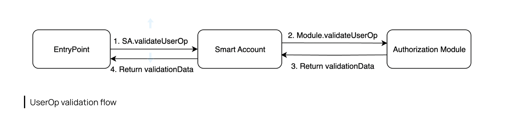

# Overview

Modular Smart Accounts offer more flexibility than 'static' accounts. Static accounts often need a developer for changes and involve complex proxy upgrades. In contrast, Modular Smart Accounts lets users install or uninstall modules, avoiding the need for redeployment.

Biconomy MSA (Modular Smart Account) has two types of modules:

- **Validation modules** - These modules define different signature schemes or authorization mechanisms to validate who is allowed to perform what action on the account, by implementing standard interfaces.
- **Execution modules** - These modules define custom execution functions to facilitate the actions allowed by the account.

ERC-7579 extends the objectives of ERC 4337, specifically the goal of abstracting logic for execution and validation for each modular smart account. It also enables developers to standardize these modules, to integrate new features for smart contract wallets, rather than building an entire account.

### How to enable modules

The Modular smart account is structured for optimal adaptability. Instead of storing ownership data internally or relying on a fixed signature verification method, it empowers users to choose their primary validation module. This flexibility, as part of Biconomy's [SmartAccountFactory](https://github.com/bcnmy/scw-contracts/blob/main/contracts/smart-account/factory/SmartAccountFactory.sol#L73), ensures each account can validate userOps effectively and support diverse user requirements.

:::note
The module selected to deploy the MSA determines its final address, due to MSA's counterfactual nature at deployment.
:::

In addition to enabling the module, It also mandates the **moduleSetupData** to set up the module by the smart account during initialization. It only stores a reference to the module address, thus making it possible for multiple modules to use the same function selector.

Each account must have a default validation module which gets used when no is enabled. All validation modules can act as active validation modules, but the ones with the following functionality can act as default validation modules.

:::caution
It's crucial to have at least one module in a Smart Account. Without a module, the Smart Account might become lost or unrecoverable.
:::

## Validation Modules

The validation Module is a module that extends the abstract contract **BaseAuthorizationModule**** - which implements the **IBaseAuthorizationModule** interface. This interface requires the implementation of the following methods:

- `validateUserOp`: this method validates userOperation. It expects userOp callData to execute method calls of the Smart account and userOp signature being the ABI-encoded signature and module address.
- `isValidSignature`: this method validates an EIP-1271 signature.
- `isValidSignatureUnsafe`: this method validates an EIP-1271 signature but expects the data Hash to already include smart account address information.

Validation modules are invoked with a “call”. It has its own storage and doesn’t share storage with Biconomy Smart Account. Since validation module storage is accessed during the validation phase, ERC-4337 [storage rules](https://github.com/eth-infinitism/account-abstraction/blob/abff2aca61a8f0934e533d0d352978055fddbd96/eip/EIPS/eip-4337.md#storage-associated-with-an-address) apply to this.

:::info
Validation Modules in MSA play a crucial role in determining who can perform actions, ensuring security and proper authorization.
:::

Following is the list of Validation Modules:

- [**ECDSA Ownership Module**](ecdsa.mdx): This module is widely adopted as a validation module for Biconomy smart accounts. It can seamlessly integrates with MPC providers such as Web3Auth, abstracting EOA Private Key storage and enabling a web2-like experience such as email login.
- [**Multichain ECDSA Validator Module**](multichain.mdx): This module significantly improves UX for deploying and setting up Smart Accounts on several chains. It is an extension of ECDSA Module enabling used to dispatch multiple userOps on different chains using a single signature.
- [**Session key Manager Validation Module**](sessionvalidationmodule.mdx): This module enables the use of sessions to execute transactions. It verifies whether a given user operation adheres to the permissions defined within the session key and confirms that the operation has been signed by that session key. This can only be used as an active validation module.
- **MultiOwnedECDSAModule**: This is an alteration of ECDSA Module which allows multiple signers to be set up, and any one of the enabled owners can authorize a transaction using ECDSA signature.

### How to create a custom Validation Module

Developers have the flexibility to create a custom validation module according to their specific requirements. This validation module must extend the BaseAuthorizationModule, which further implements the IAuthorizationModule and ISignatureValidator interfaces.

**Key Imports and Their Roles**

1. `BaseAuthorizationModule`
    - **Core Structure**: Forms the foundation of your custom module.
    - **Link to Interfaces**: Connects to IAuthorizationModule and ISignatureValidator
2. `IAuthorizationModule`
    - **Operation Validation**: Manages validation of user operations (userOp)
    - **Method Implementation**: Defines methods for operation validation your module must implement.
3. `ISignatureValidator`
    - **Signature Security & Standardization**: Focuses on signature validation and adheres to the ERC-1271 standard for smart contract-based signature
    - **isValidSignature Method**: Essential for verifying signatures and ensuring security.

:::note

Adhering closely to the functionalities and specifications of these interfaces and standards is fundamental. It ensures your custom validation module operates securely and efficiently.

:::

After thorough testing and auditing, a pull request (PR) can be submitted to integrate the module with the SDK. A detailed walkthrough of the same is linked [here](/tutorials/customValidationModule).

## Execution Modules

**Execution functions** execute any custom logic allowed by the account.

There are two default execution functions - called execute and executeBatch which allow for open-ended execution that is required for AA-flow. The custom execution module needs to call back into Smart Account to initialize a function call from within the context of the account.
The diagram below illustrates the execution flow for Modular Smart Accounts.

:::caution
Execution modules should be carefully developed and integrated, as they directly control the actions an account can perform.
:::
