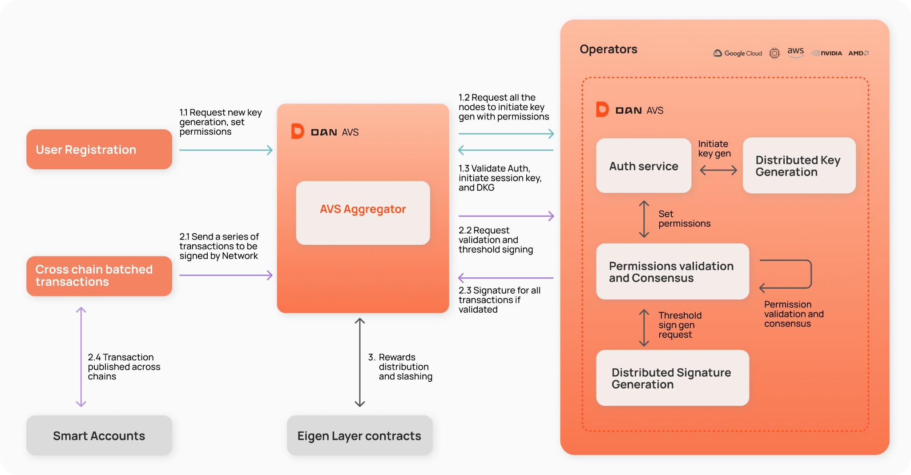

:::info 
Distributed Session Keys are a beta feature and are subject to change. To use this feature use our beta package `@biconomy-devx/account` instead of `@biconomy/account`, add the following bunfig.toml configuration:
```toml
[install.scopes]
silencelaboratories = { token = "$VITE_SILENCE_LABS_NPM_TOKEN", url = "https://registry.npmjs.org" }
```
And obtain the `VITE_SILENCE_LABS_NPM_TOKEN` from our support team, and add it to your .env file.
:::

# Distributed Sessions with DAN

## Introduction

Biconomy’s Distributed Sessions are a powerful feature designed to enhance the efficiency, security, and user experience of decentralized applications. Leveraging Biconomy’s Delegated Authorisation Network (DAN), our distributed sessions solution provide a seamless way to manage authorization keys on MPC network and automate transactions securely, within given permissions context and efficiently. This product offers developers a zero-development, zero-custody sessions solution that can be easily integrated directly from the frontend.

[skip to the tutorial](../../tutorials/sessions/createSession)

## What is DAN?



The Delegated Authorisation Network (DAN) is Biconomy’s blockchain-agnostic programmable signing infrastructure, which leverages the economic security of Eigenlayer AVS. It is designed to enhance the security, customizability, and speed of managing authorization keys for smart accounts. Read more about DAN [here](https://www.biconomy.io/post/introducing-dan-the-programmable-authorisation-network-for-ai-agents)

## Benefits of Distributed Sessions with DAN

**Enhanced Security:** Distributed sessions minimise the exposure of the private key by storing shards in the nodes and generating signature if certain conditions are met. In context of a session, they are ephemeral and even if a session key is compromised, the attacker gains limited access, protecting the user's main account and funds.

**Interoperable:** By storing private keys on the DAN network, even if the browser crashes or browser storage is compromised, users can still access their sessions.

**Automation and Efficiency:** Users can leave an intent, go to sleep and automated transactions will still be processed in a secure way.

## How Can I use it?

Currently when you create a session our [ABI session validation module](./abiSessionValidationModule) is used, and permissions are stored on-chain. However, the private key associated with these permissions can be stored in DAN by setting the `storeSessionKeyInDAN` to `true` while calling the [`createSession()`](../../tutorials/sessions/createSession) helper.
If you want to generate a session key with dan, or sign a message using the session key then the following utility helpers can be used:

- [generateSessionKey()](../../tutorials/utils/DAN/generateSessionKey)
- [signMessage()](../../tutorials/utils/DAN/signMessage)

### Coming Soon...

We will soon also facilitate the permissions object being passed to DAN (off chain) which will omit the need to use our ABI SVM and associated gas costs. 

[Get started](../../tutorials/sessions/createSession)