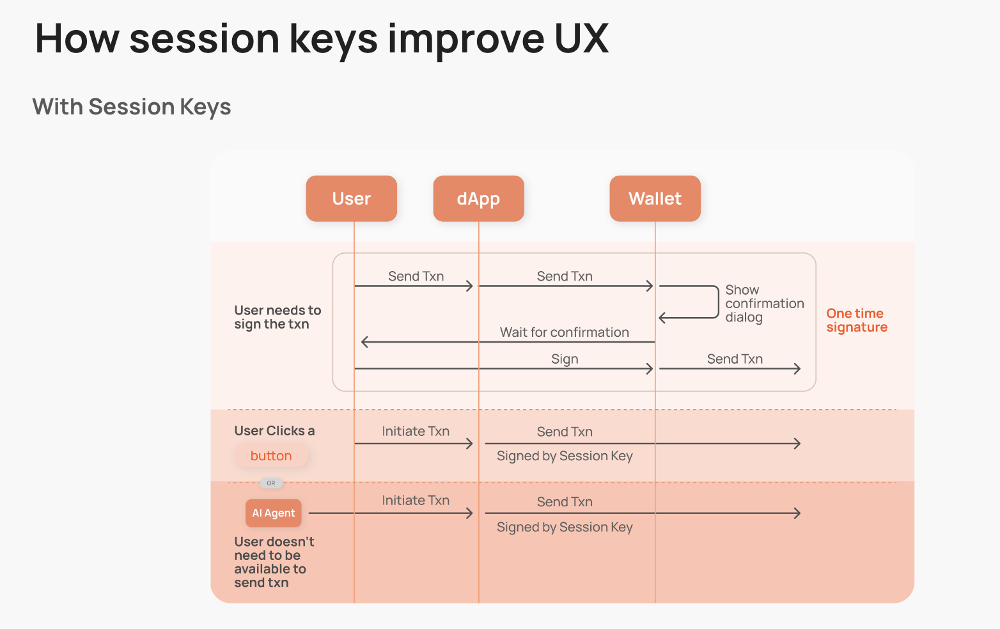

# Using Sessions with Biconomy

## Introduction

Session keys are a important feature of Biconomy’s Smart Accounts, providing versatile applications that enhance both security and user experience. Understanding the potential of session keys can significantly benefit your dApp development.

If you are already familiar with session keys, you can skip to the [tutorial](/tutorials/sessions).

## What Are Session Keys?

In traditional Externally Owned Account (EOA) wallets, a single private key is used to sign all transactions. This means whoever holds the key controls the wallet, making the protection of the seed phrase (a representation of the private key) crucial.

However, with Biconomy’s account abstraction wallets, the wallet can be decoupled from the key. This allows the wallet owner to assign different keys with specific permissions to execute transactions on their behalf. These permissions can be short-lived and revoked at any time.

These scoped keys, known as "session keys," can be configured to send a limited set of transactions under specific conditions and within a defined time window. In essence, session keys are temporary keys with limited set of permissions on a smart account that can do transactions under specific conditions for a limited duration

## Why Use Session Keys?



### Streamlined User Interactions

Session keys simplify the authentication process, enabling users to interact with dApps without needing to confirm every action using their primary key. Users can create a session key with permissions specific to the app, allowing for smoother and faster user interactions with fewer clicks

### Automation

With session keys, users can delegate specific permissions, automating actions within predefined limits. This is particularly useful for recurring payments, contract interactions, or any activity that benefits from automation.

#### Examples of Automation

- **Trading Bots:** Set up session keys to allow trading bots to execute trades on your behalf based on predefined conditions and strategies, without needing manual confirmations for each transaction.
- **AI Agents in DeFi:** Utilize AI agents to manage your DeFi investments. These agents can perform tasks such as yield farming, liquidity provision, and portfolio rebalancing using session keys to automate the necessary transactions.
- **Dollar Cost Averaging (DCA):** Implement a DCA strategy by using session keys to make regular, periodic purchases of a cryptocurrency. This can help mitigate the impact of market volatility and simplify the investment process.
- **Recurring Payments:** Automate recurring payments for services or subscriptions by setting up session keys with spending limits and time constraints.
- **Contract Interactions:** Enable smart contracts to interact with other contracts or services automatically based on certain triggers or conditions.


### Enhanced Security

By minimizing the exposure of the main private key, session keys add a layer of security. Even if a session key is compromised, the attacker does not gain access to the user's main account and funds. This layered security approach helps mitigate risks associated with key management.

## Applications of Session Keys

### Skipping Confirmations

For highly interactive applications, requiring users to manually confirm each transaction can be cumbersome. By creating a session key for the user's current session, you can scope the key to send only the necessary transactions for your application. The key expires after the session, allowing the user to interact with your app seamlessly without needing to use their primary key for every transaction.

### Delegating Transactions

Traditionally, transactions need to be initiated by the wallet owner. However, in some cases, automated transactions offer the best user experience. For instance, in a lending protocol, you might want to automatically close a user's position if it is in danger of liquidation. A session key can be created to allow this action only under specific conditions, and this key can be managed by a "watcher" (potentially your own server) that executes the transaction when necessary.


```mdx-code-block
import DocCardList from '@theme/DocCardList';

<DocCardList />
```