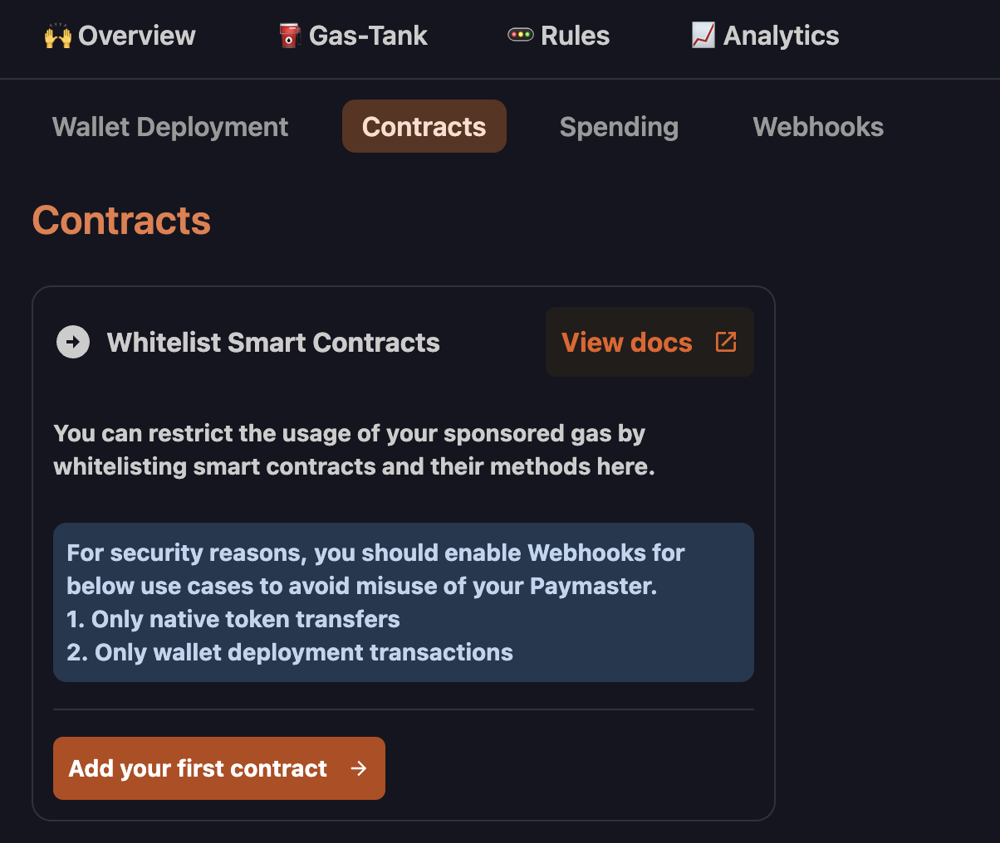

# Paymaster Policies

Before using a Paymaster to sponsor a transaction you will need to register your smart contracts and white list the methods that will be called in your dApp.

## Register a Smart Contract

Navigate to the Paymaster you have created, then click policies and contract. If this is the first time you are adding a smart contract the page will look like this:

Click on Add your First Contract and a side menu will show up asking you for details. Name your contract and provide an address. If your contract is verified the dashboard will automatically fetch the ABI for it, otherwise you can manually paste in the ABI yourself. You will then be able to choose any write methods to whitelist for sponsorship. In the example below I added the USDC contract on the Goerli testnet and chose to authorize the approve method for sponsorship.

## Updating your Smart Contract

After adding your contract and whitelisting your methods you can make a few changes on the contract.

- You can edit the contract to change the name or update which write methods you would like to authorize.
- You can pause the contract to temporarily stop any sponsorships
- You can delete the contract if you no longer need it on your Paymaster at all

