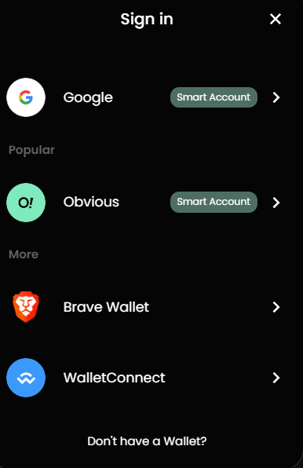
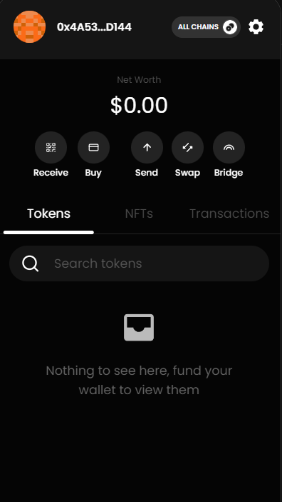
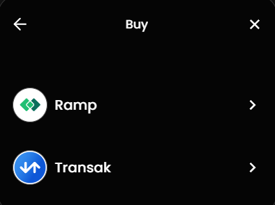
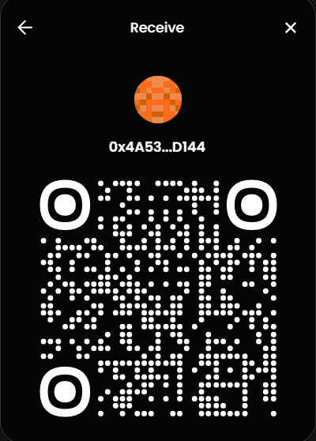
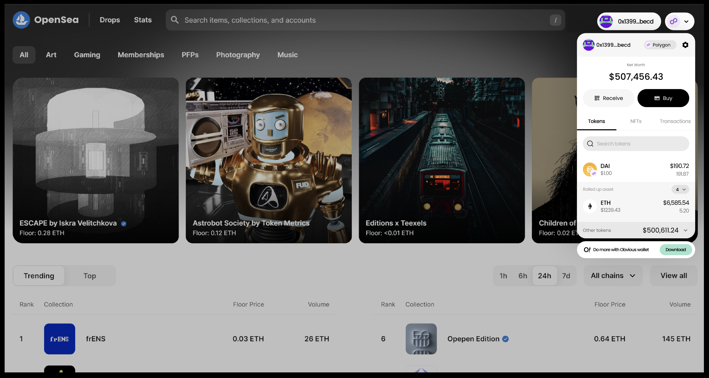

# Obvious - Embedded Wallet UI Kit

Developers can now integrate Biconomy’s account abstraction-based wallet in their apps in just 5 minutes and a few lines of code. Our partners at Obvious have built out a UI kit on our existing infrastructure that removes the need for developers to build an in-app wallet UI experience for the user. The developers can now use the Obvious Embed for a smooth in-app Smart Account experience.

**What do dApps get by integrating with the Obvious Embed kit?**

- Obvious embed kit helps developers to build for both EOA & SCW by abstracting out complexities around gas fees.
- Standard signer & provider interface for EOA & SCW
- UI Kit for showing portfolio across multiple chains, including tokens, NFTs & transaction history
- UI Kit for 1-click swapping & bridging of tokens
- Customizations (colors & styles) that can be plugged into your dApp, as a popup or a separate tab, with minimal effort.
- [Obvious](https://www.obvious.technology/) as a wallet partner, built on top of Biconomy Account Abstraction SDK, users of your dApp can take their credentials and log in to Obvious Wallet for a complete wallet experience.

The pictures below give you a peek into what the Obvious Embed UI looks like and the cool features it comes with.

   

This is how the wallet embed might be integrated into the application, seamlessly blending with its interface and functionality.

[**Link for the SDK Docs**](https://obvious-embed.vercel.app/docs)

[**Obvious Embed**](https://obvious-embed.vercel.app/)

**[Contact](https://t.me/SarDwi8) Biconomy's BD/Sales team to integrate with Wallet UI Kit.**
