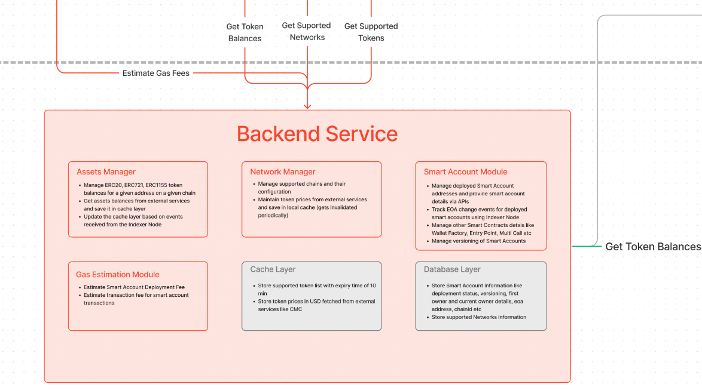

# Backend Service

> SDK relies on a backend client for gas estimation endpoints, configurations, indexer communication etc.

The backend Service is there to support client SDK and provides APIs to perform tasks that are not effectively done on the client side.

For example, it provides APIs to fetch token balances of smart accounts, APIs to do gas estimation for certain operations, etc.

The main services of the Backend node are described below.

