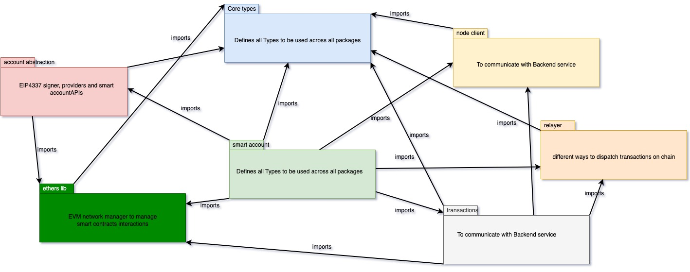

# Client SDK

> client SDK overview

Biconomy SDK is a collection of packages shipped as a mono repo. You can use one module, several modules, or the entire stack.

Core packages and their dependencies are described below.

- Smart Account
- Node client
- Core types
- Account abstraction
- Relayer
- Transactions
- web3-auth
- Gas estimator (WIP)

