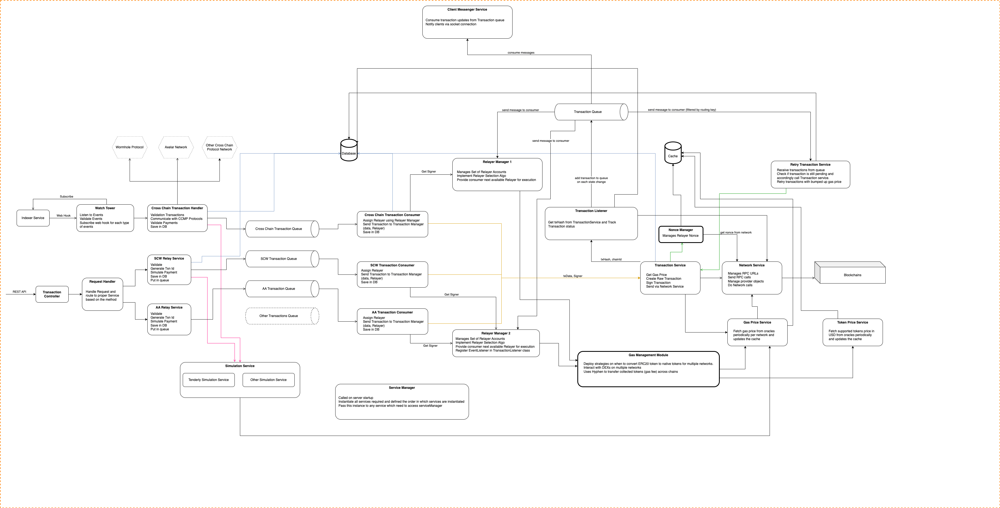

# Relayer Node Service

Relayer Node Service is responsible for signing valid transactions, paying their gas fees, and sending them to the network.

Biconomy Relayers allows you to send transactions and takes care of transaction signing, nonce management, gas pricing estimation, and resubmissions. This way you don’t need to worry about monitoring transactions to ensure they get mined.

Each Relayer is essentially an EOA. Biconomy's relayer infrastructure composes of multiple such EOAs on each chain. Every relayer has an inbuilt auto-scaling functionality. Thus in cases of a high load of transactions, the relayer infra can auto-spin up additional relayers to handle this.

## Architecture

The Relayer Node Service is divided into the following main components.

- **Common**: Has all the services that would be shared by every entity of the project. These include database, caching, gas price service, network service, logger, etc.
- **Server**: Has all the routes along with validations of request bodies and simulation check middleware.
- **Relayer**: Contains the core logic of relayer management and transaction handling. This part also takes care of transaction resubmission and notifying the client regarding the state of a transaction.

## Detailed Service Overview

Below you will find a detailed explanation for every service that is there in the relayer node.

### Common

- **Cache**: Connects to Redis and has functions to interact with the cache layer
- **Constants**: All Abis, constant values go into this
- **Gas Price**: Includes the gas price manager and services that are responsible for scheduling gas price schedulers, fetching gas prices & getting bumped up gas prices for resubmitted transactions. Both regular gasPrice and EIP 1559 gasPrices are available.
- **Health Check APIs**: These APIs are built in to check if servers are up and running for the relayer node
- **Interfaces**: Contains all the common interfaces that are required throughout the project.
- **Logger**: A module that is responsible for logging across the project.
- **Maps**: Certain maps that are to be maintained and used go in here.
- **Network Service**: The network service is the most important service as it is responsible to get data from the blockchain, sending transactions, and getting gas prices. All the interactions with the blockchain happen via this service.
- **Queue Manager**: RabbitMq queues are used to manage transactions as messages for various services to push and consume. There are queues for every chain id and transaction type. And also some common queues for transaction handling and retry transaction handling.
- **Relay Service**: This service is responsible to relay transactions to the relayer side from the server side. It basically pushes to respective queues based on chain id and transaction type.
- **Scheduler**: Schedulers are used to have cron jobs for services that require actions to be triggered at regular intervals.
- **Service Manager**: This is the main service setup manager where all the instances of various services are created and all instance mappings are exported from. It is also responsible for creating database and cache instances and creating their connections.
- **Simulation Service**: To check if a transaction would succeed on-chain we simulate transactions beforehand. It is also used to calculate gas used in a transaction to be used as gasLimit.
- **Token Price Service**: For users to pay back the relayers in ERC 20 tokens, we need the prices for those tokens in comparison to the native token price. Token Price Service does just this and gets prices through Coin Market Cap API.
- **Types**: Type definitions that are to be used across various services go in here.
- **Utils**: Contains utility functions.

### Server

- **Relay**: Endpoint for relaying transactions.
- **Fee Options**: Endpoint for getting fee options.

### Relayer

- **Account**: An account can be a relayer address or the main funding account.
- **Consumer**: Consumers are actors that are responsible for consuming data from the queue and acting upon it, be it starting transaction processing or alerting the socket server.
- **Nonce manager**: Manages the nonces of various relayer addresses and main accounts by using cache and network service.
- **Relayer Manager**: One of the core components that takes care of creating relayers, funding them, maintaining relayer mappings and various relayer queues, and fetching the next active relayer from the relayer queue.
- **Relayer Queue**: A simple queue that has a list of relayers sorted basis on some pre-defined logic. Be it who has the maximum balance or least pending count.
- **Retry Transaction Service**: In case a transaction is not mined for a set time, the transaction is resubmitted again to the network by the same relayer and same nonce but at a bumped-up gas price.
- **Transaction Listener**: Once a transaction is sent on the chain, the state of the transaction is monitored by the transaction listener. It pushes to the retry transaction queue, and at the same time listens for transactions confirmed or failed on the chain and then saves the data in the database.
- **Transaction Publisher**: The transaction publisher is just an interface for the publishing queue of the transaction queue.
- **Transaction Service**: This service is responsible for creating the raw transaction by fetching gas prices, then using the network service to broadcast the transaction and notifies the transaction listener to monitor a particular transaction.
