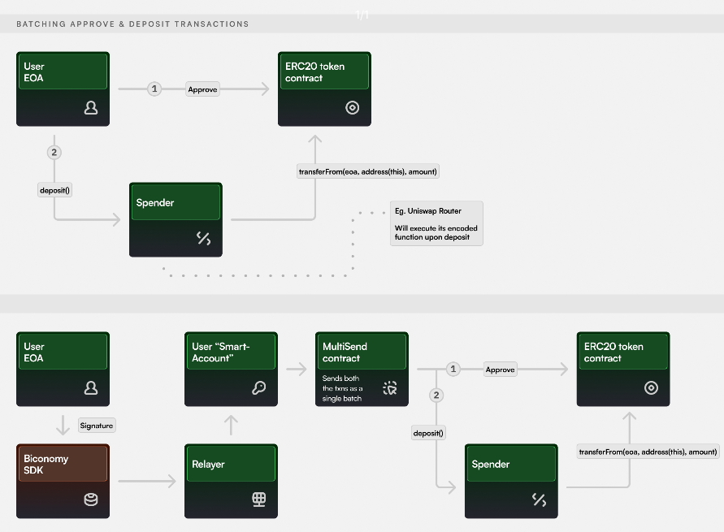

# Batch Transactions

Evolving from simple externally owned accounts (EOAs) to contract-based accounts enables a lot of advantages and features. One such feature that is only available for smart contract-based accounts is batched transactions. Batched transactions allow users of the wallet to perform multiple transactions in one single on-chain transaction.

There are a number of advantages to batching many transactions into a single transaction.

One advantage is that of efficiency — batched transactions save both in cost and time. Each transaction on Ethereum costs 21,000 gas as a base fee. Provide your users with incremental gas savings by enabling batches of transactions at once.

Additionally, a user can save time and experience less friction when attempting to send sequential transactions.

If you wish to skip the explanation of how batched transactions work via BiconomySDK, you can directly navigate to Enable Batch Transactions within your dApp.

## Flow Explained

Batched transactions also allow for an enhanced user experience. An obvious example is removing the need to call both approve and transferFrom on an ERC20 token in two separate transactions. This leads to dApp developers designing their dApps with a more familiar web 2.0 feel — no need to explain the intricacies of the blockchain and perform all required steps in a single button.

There is no need to modify existing contracts in order to be able to access batched transactions. Smart Contract Wallet calls the MultiSendCall contract (with delegatecall) by preparing the call data on execTransaction or execFromEntryPoint methods, where to address is multiSend's address and data is a batch of transactions encoded as bytes.

When implementing this, one must consider a potential failed transaction. A well-designed implementation will check for the return status of the call and fail the entire batched transaction if any of the calls fail. With this implementation, the transaction would fail atomically (all or nothing) and save users from unintended consequences, such as approved tokens that go unspent.

Transaction batching also helps mitigate MEV in case you are doing high-volume DeFi trades. This helps avoid the transaction being front-run for extracting value.

In order to enable this flow, please check out our Guide to Enabling Batched Transactions (React).