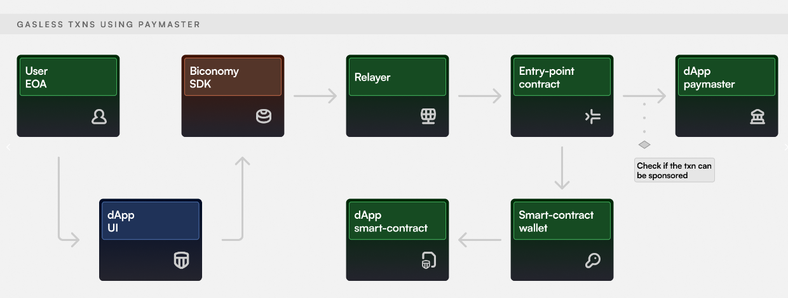

# Gasless Transactions

Users must possess chain native tokens to interact with a dApp on any chain. For example, anyone who wants to send an Ethereum transaction needs to have Ether pay for its gas fees. This forces new users to purchase these crypto tokens before they can start using a dApp. This is a major hurdle in user onboarding which can be mitigated by enabling gas sponsorship within your dApp.

In the Biconomy SDK, gasless transactions happen in a non-custodial manner via [Account Abstraction](https://coinmarketcap.com/alexandria/glossary/account-abstraction). In this mechanism, there is a Paymaster contract that acts like a 'Gas Tank'. All you need to do is deposit funds into the Paymaster & whitelist your dApp contracts to enable gas abstraction within your dApp.

If you wish to skip the explanation of how gasless transactions work via BiconomySDK, you can directly navigate to:

1. Register dApp On Dashboard & Deposit Gas
2. Enable Gasless Transactions using Biconomy SDK (React)

## Flow Explained

In this case, dApp is sponsoring the transaction gas fee using gasless transaction using the concept of paymasters as mentioned in [EIP-4337](https://eips.ethereum.org/EIPS/eip-4337) (Account Abstraction).

EIP-4337 proposal introduces a higher-layer pseudo-transaction object called a `UserOperation`. Users send UserOperation objects into a separate mempool. A special class of actors called *bundlers* (either miners, or users that can send transactions to miners through a bundle marketplace) package up a set of these objects into a transaction making a `handleOps` call to a special contract, and that transaction then gets included in a block.

- **UserOperation** - a structure that describes a transaction to be sent on behalf of a user.
  - Like a transaction, it contains “sender”, “to”, “calldata”, “maxFeePerGas”, “maxPriorityFee”, “signature”, “nonce”
  - Unlike transactions, it contains several other fields
  - Also, the “nonce” and “signature” field's usage is not defined by the protocol, but by each account implementation
- **Sender** - the account contract sending a user operation.
- **EntryPoint** - a singleton contract to execute bundles of UserOperations.

Users send `UserOperation` objects to **bundlers** (in this case, Biconomy's relayers act as bundlers). Bundlers pick `UserOperation` and create **bundle transactions**. A bundle transaction packages up multiple `UserOperation` objects into a single `handleOps` call to a pre-published global **Entry Point contract.**

**Paymasters** are contracts that can be used by dApps to sponsor gas fees for users. For enabling gasless you can use the pre-deployed `BiconomyVerifyingPaymaster`. It is pre-configured and ready to use. You will only have to deposit tokens which will be used for gas sponsorship. This amount in case it hasn't been used can be withdrawn by the dApp at any point.

Here how the transaction flow looks like:

- The user initiates a transaction and provides their signature via Biconomy SDK.
- The signature is sent to a Relayer(Bundler), which then posts the transaction on-chain via an Entry Point contract. Entry Point does signature verification and uses paymaster to recover the gas fee from dApp’s deposit (Paymaster is essentially dApp’s on-chain Gas Tank).

The paymaster scheme allows a contract to passively pay on users’ behalf under arbitrary conditions. You can specify these conditions - calls to certain or all methods of a contract can be whitelisted on the dashboard.

You can start by Registering your dApp on the Dashboard. Here you will also be able to fund the gas tank & whitelist contracts. Then you can Enable Gasless Transactions using Biconomy SDK (React).

## Supported Chains

- Ethereum Mainnet
- Polygon Mainnet
- BSC Mainnet
- Polygon ZkEvm Mainnet
- Arbitrum One Mainnet
- Arbitrum Nova Mainnet
- Goerli Testnet
- Polygon Testnet
- BSC Testnet
- Polygon ZkEVM Testnet
- Arbitrum Goerli Testnet

:::info
If you wish to enable gasless transactions within your dApp for only EOAs & in a custodial way, please check out our guide to [Enable Gasless via Meta-Transactions.](https://docs-gasless.biconomy.io/products/enable-gasless-transactions)
:::
