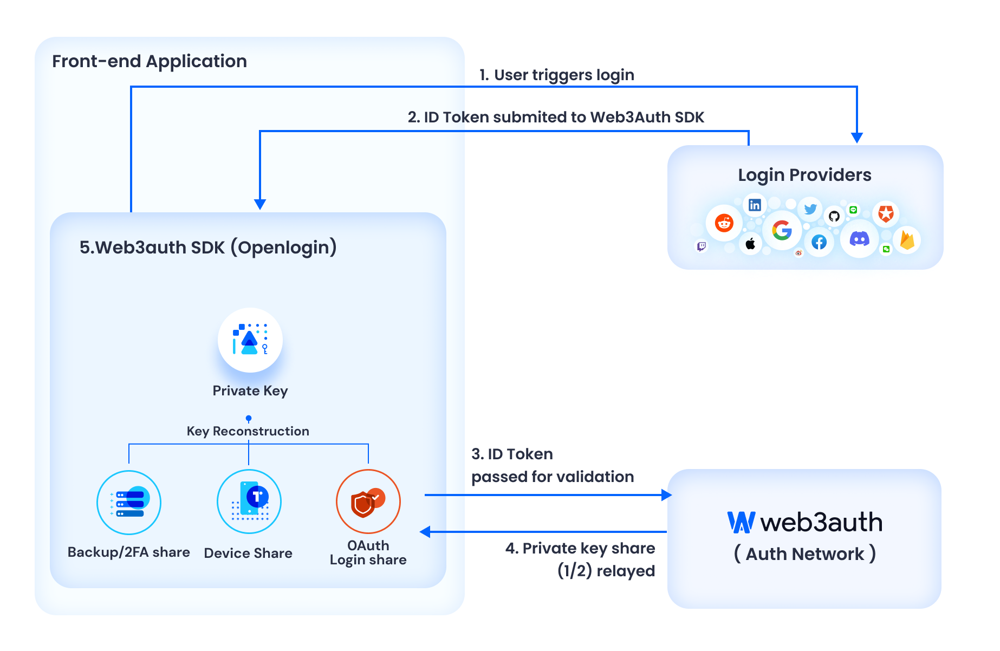
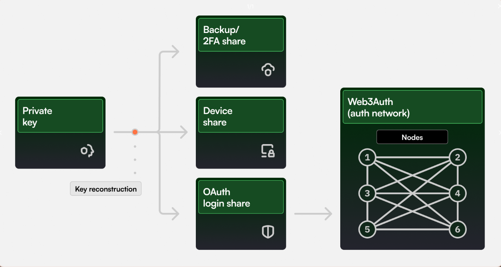

# Using Web3Auth (Torus)

Web3Auth is an innovative, pluggable authentication infrastructure designed for Web3 wallets and applications. It significantly simplifies user onboarding by providing familiar experiences and supporting a wide range of login methods. Whether your users are mainstream or crypto-native, Web3Auth can get them onboarded in under a minute.

## How Does Web3Auth Work?

Web3Auth supports all social logins, web & mobile native platforms, wallets, and other key management methods. It generates a standard cryptographic key specific to the user and application, ensuring secure and personalized access.

Here's a step-by-step breakdown of the Web3Auth flow:

1. **User Initiation**: The user starts the process and is redirected to the Web3Auth portal (app.openlogin.com).
2. **Initial Login Process**: The Web3Auth portal handles the initial login process.
3. **Authentication with OAuth Provider**: The user is redirected to their chosen login/OAuth provider and completes the authentication process.
4. **Key Reconstruction**: The user is redirected back to the Web3Auth portal, which handles the reconstruction of the user’s key.
5. **Successful Authentication**: Once the user is successfully authenticated, they are redirected back to the application, equipped with a derived key specific to the application/wallet.

## Key Management Infrastructure

Web3Auth introduces a multi-factor account-like approach to key management. Users leverage OAuth logins, devices, and other factors to manage their key pairs. The private key is mathematically divided into parts (the "shares"), which can only reconstruct the key when a sufficient number of shares are combined. Each share individually reveals no information about the private key.

Here's an example setup with three shares:

1. **Device Share**: Stored on the user's device. The implementation is device and system-specific. For instance, on mobile devices, the share could be stored in device storage secured via biometrics.
2. **OAuth Login Share**: Managed by a login service via node operators. This share is further split amongst a network of nodes and retrieved via conventional authentication flows.
3. **Backup/2FA Share**: Acts as a recovery share. It's an extra share kept by the user, possibly on a separate device, downloaded, or based on user input with enough entropy (e.g., password, security questions, hardware device, etc.).

Similar to existing 2FA systems, a user must prove ownership of at least 2 out of 3 shares to retrieve their original private key and use it to sign transactions.

To enable this flow, please check out our guide to Enable Social Logins within your dApp.

## Demos

1. [Integrating Web3Auth with Biconomy AA SDK by Nader Dabit (DeveloperDAO)](https://www.youtube.com/watch?v=qBPoVs66CxE)

## For FAQs related to Web3Auth and Key Management

Please refer to the Web3Auth Key Management docs to learn more about the inner workings of the system: [Web3Auth Key Management](https://web3auth.io/docs/overview/key-management/)
