# Biconomy Dashboard

The Biconomy Dashboard enables organisations and developers to leverage Account Abstraction stack in their projects. You can configure your project to pay gas fees for your users through Paymasters, add conditions for gas sponsorship. By registering your paymaster for any of the supported chains, you can begin simplifying the Web3 experience for your users.

The instructions below will walk you through the following:

1. Creating an account on the Biconomy Dashboard
2. Registering your paymaster on the dashboard
3. Setting up a Gas Tank
4. Whitelisting your contracts and methods
   
**In order to use the Biconomy SDK in your project, it is important to complete all four steps mentioned above.**

## Let’s Get Started

### Create an Account or Login to the Biconomy Dashboard

- Register your account on the dashboard here: https://dashboard.biconomy.io
- Once registered, you will see the dashboard homepage, as shown in the figure below:
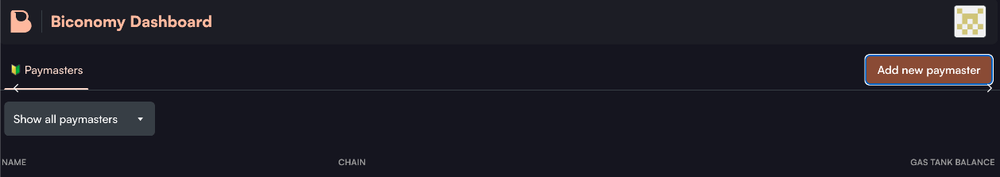

### Register your Paymaster on the Dashboard

- On the top right of the homepage, you will see a button labeled **Register new Paymaster**. Clicking that will open the registration modal pictured below.
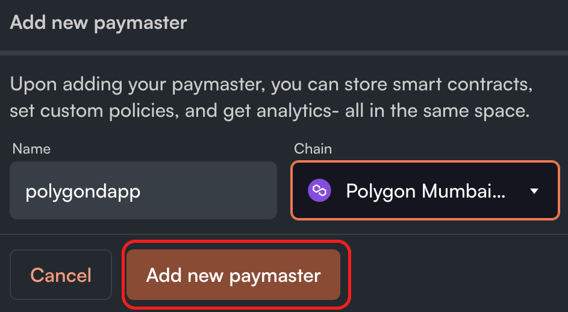

- Create a **name** for your Paymaster and select a **chain** as shown in the figure below, and click **Add new Paymaster** once completed.
- Now that you have registered your Paymaster, you will be redirected to the Paymaster main page.
- On the Paymaster main page, you can see your Paymaster **API key**, **chain** your Paymaster is connected to, and a **set up gas tank** button, as shown below.
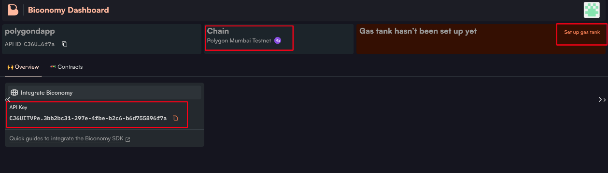

### Setting up a Gas Tank

Gas Tank is another term for Paymaster. We have created a Singleton Verifying Paymaster for you, so you don't need to deploy a new Paymaster. We handle its stake on the EntryPoint contract, so you don't have to worry about these things. Check out the [code here](https://github.com/bcnmy/scw-contracts/blob/master/contracts/smart-contract-wallet/paymasters/verifying/singleton/VerifyingSingletonPaymaster.sol).

To enable gas-free transactions in your dPaymasterApp, **Gas Tanks** must be utilised. The Dashboard enables you to create your own Gas Tank, fund it, and withdraw gas as needed in a secure and non-custodial manner. Gas Tanks should be thought of as separate from Paymaster; they are a deposit and withdrawal location for gas that can be used in multiple Paymaster to cover gas fees. The conditions for sponsoring the gas are linked to your Paymaster.

### Steps to set up your Gas Tank

- Once you click on **setup gas tank**, you will see a connect wallet button. Setting up a gas tank requires you to have a decentralised wallet with some native tokens balance on the chain your Paymaster is registered on.
- Once you click on **connect wallet**, you will see different wallets that can be connected to top up your gas tanks as seen below.
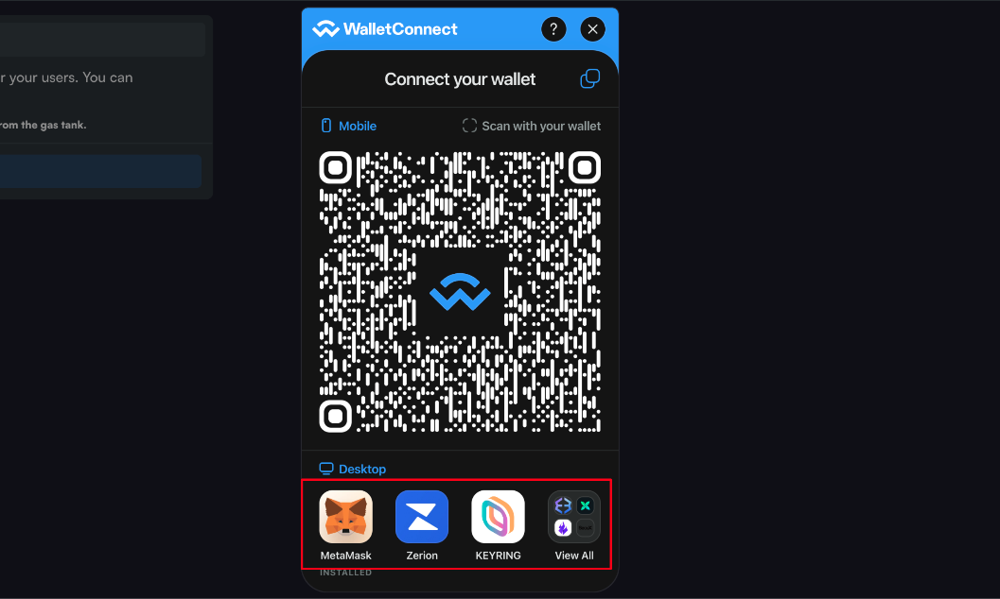

- Once your wallet is connected. you will see your connected **wallet address**.
- Note: Please be aware that the address you used to connect during these steps is the only address that will have the ability to withdraw funds from this gas tank in the future.
- Check off the **I Understand** icon and click **Set up gas tank**. You will be asked to sign a message from your wallet. As you are only **signing**, this is not a blockchain transaction.
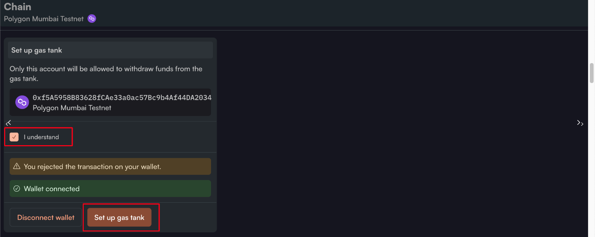

- Now that your gas tank is setup successfully you will be redirected to the **Deposit** flow.
- The current state of your Gas Tank should look like the image below.
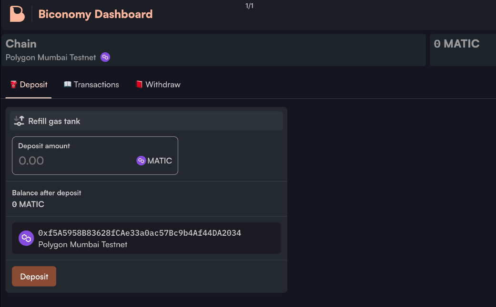

### Deposit Gas

- Your Paymaster currently has an active Gas Tank, but it needs to be topped up in order to sponsor gasless transactions.
- You will need to ensure that you have Native tokens of your selected chain in the gas tank.
- Enter the desired funds you wish to deposit in the **Deposit amount** input field and press **Deposit** button as pictured below. After hitting the deposit button this will trigger a transaction in your connected wallet.
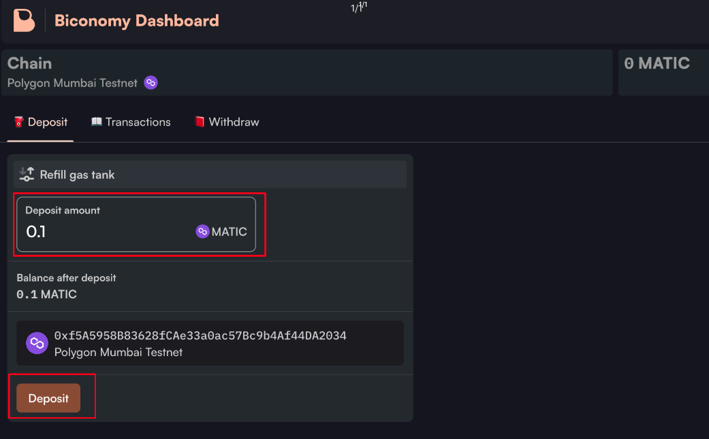

- Once your transaction confirms on-chain, you will be able to see it in the **transaction** section, and your gas tank balance will be updated with your deposit amount.
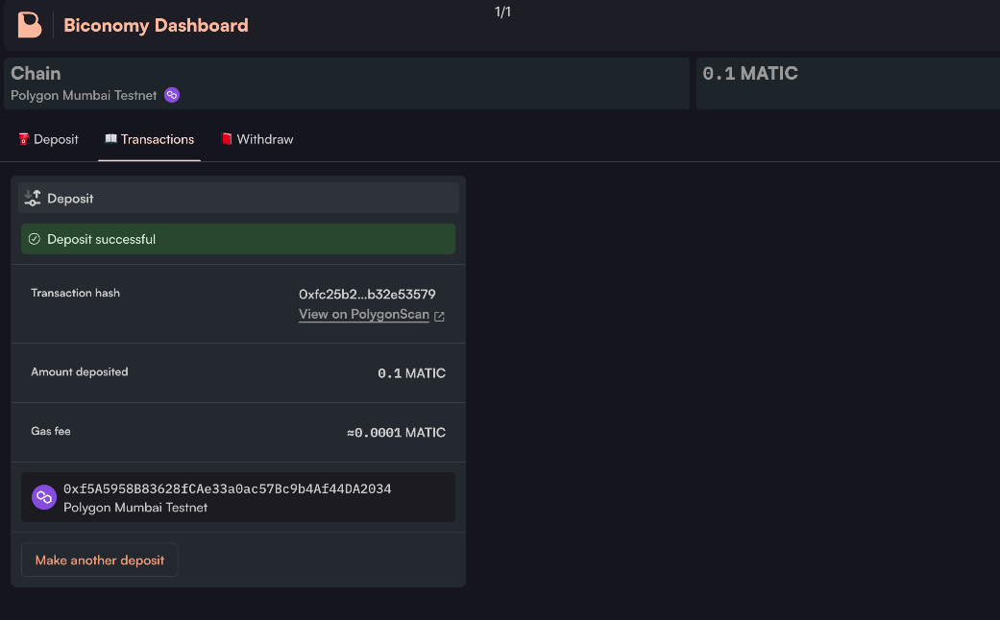

### Withdrawing Gas

After depositing funds you may want to withdraw any remaining funds in the future.:::info
Please note that only the initial wallet you used to sign and connect to this gas tank can make withdrawals.
:::

Make sure to connect with the same wallet that you have used during the setup of the gas tank.

- Once you click withdraw tab you will see the following screen as shown below.
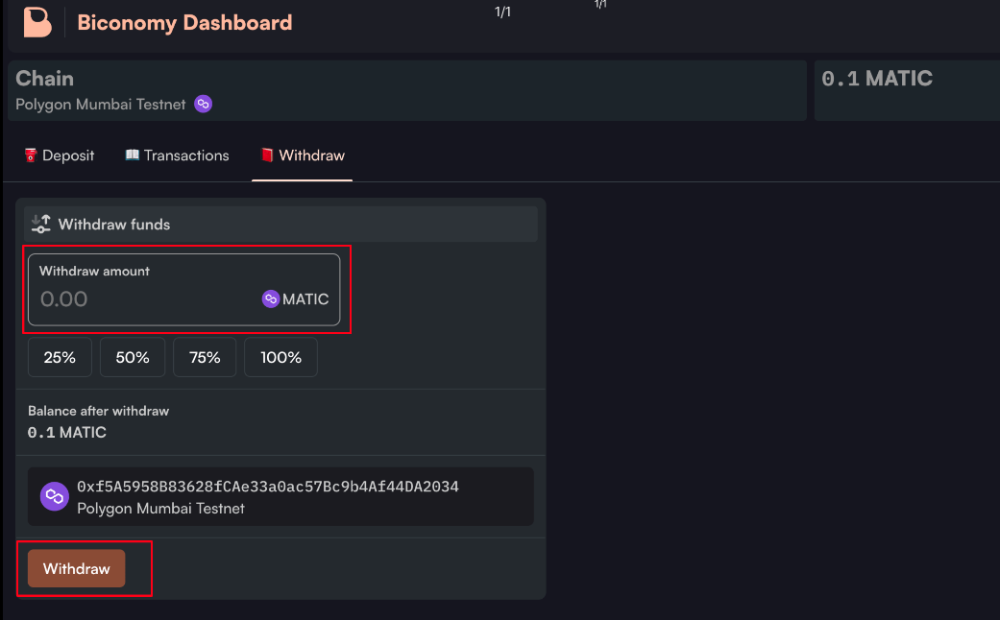
- You can enter a specific amount to withdraw in the **Withdraw amount** input field, or you can choose a percentage of funds to withdraw.
- After clicking "withdraw," you will need to sign the transaction from your wallet. Once the transaction is confirmed on the chain, the funds will be transferred to your wallet.
- Once the transaction is confirmed on-chain, you will see the following screen displaying the on-chain transaction details.
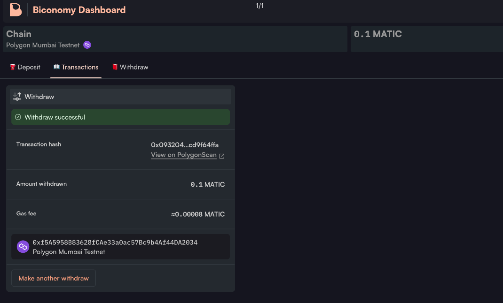

## Whitelisting your contract and methods

Whitelisting contracts in the Biconomy dashboard provides a security layer that gives the Paymaster owner more control over transaction sponsorship. Even if the Paymaster is sponsoring user transactions, users will not be able to execute any arbitrary transactions and have them sponsored by the gas tank. Transactions can only be sponsored for contracts that the Paymaster owner has whitelisted. If the Paymaster owner hasn't whitelisted any contract, then only native token transfer transactions can be sponsored.

### Steps to Whitelist your Contract

- Once you click on your Paymaster, you will see the **Add smart contract** button under the contracts tab, as shown below
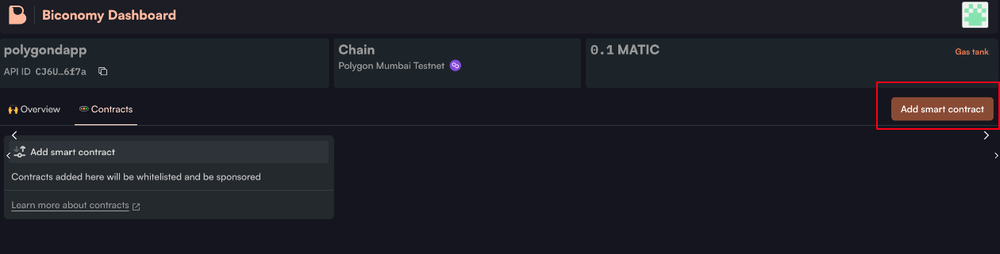
- The modal pictured below will appear after clicking the **Add smart contract** button.
- Now add the name of the smart contract. It is not necessary to use the original contract name, any name can be used.
- Next, you are required to enter the contract address that you wish to whitelist. If the contract is verified, the system will automatically populate the ABI in the corresponding field. If it is not verified you can manually paste in your ABI.
- Now, you can select the methods you want to whitelist for this specific contract and press **Add Smart Contract** button. Only these selected contract methods can be sponsored by the gas tank.
- In the example pictured below, we have whitelisted the USDC contract and only selected the transfer function call to be sponsored by the gas tank.
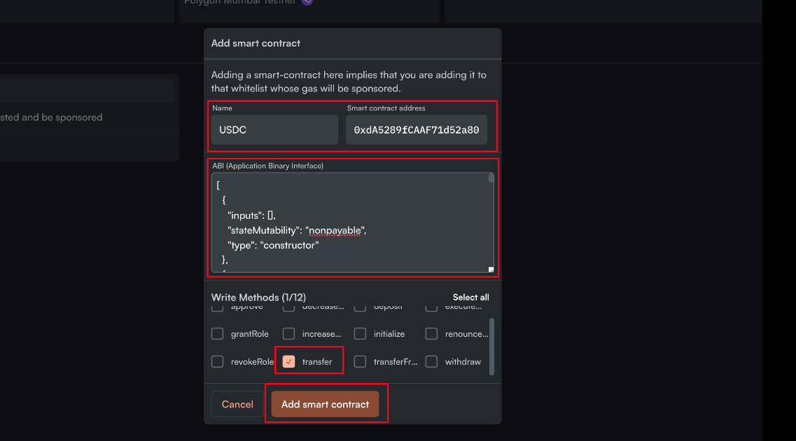

After completing the whitelisting process, your whitelisted contract details will be displayed under the "Contracts" tab. You will be able to edit, delete, activate, or deactivate any of the whitelisted contracts using the controls located under each contract, as shown in the figure below.
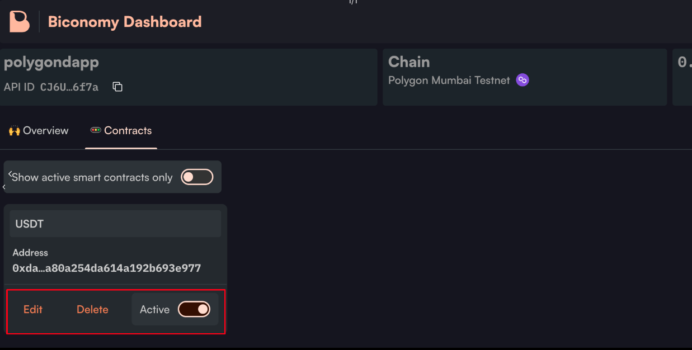

:::info
If you have any questions please post them on the [Biconomy SDK Forum](https://forum.biconomy.io/)
:::
