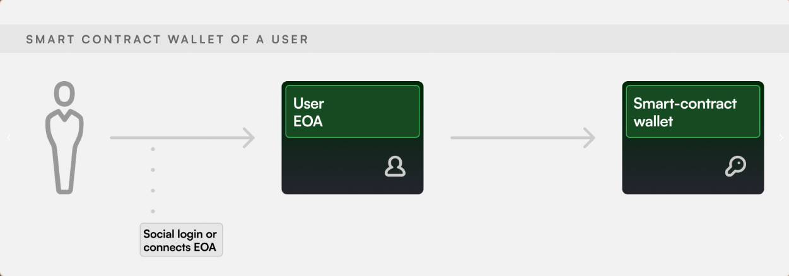

# Overview

The Biconomy Software Development Kit (SDK) build purely on atop of ERC4337 solution, presents a comprehensive range of solutions, from user onboarding to sustained engagement, specifically designed for decentralised applications (dApps). This SDK functions in a non-custodial fashion, provides a unified solution that enhances the user experience within your dApp.

Our innovative toolkit simplifies the onboarding process for new users while simultaneously addressing the daily transaction complexities experienced by existing users. The Biconomy SDK not only simplifies the user experience but also refines the underlying operations, seamlessly merging simplicity and functionality in the realm of decentralised applications. With its integration, your dApp is poised to offer an intuitive and effortless experience to its users, setting a new standard in user experience within the blockchain ecosystem.

## What’s Possible?

Biconomy SDK brings blockchain-agnostic, web2-like experiences to your dApp in a non-custodial manner. Here's what you can enable today:

- Easy User Onboarding: Social login, account creation & recovery to seamlessly onboard web2 users.
- Fiat On Ramp: Let your users easily & reliably buy/sell crypto within your dApp.
- Gasless Transactions: dApps can sponsor gas fees to make user interactions as simple as web2 transactions.
- Paying Gas Fees In ERC20 Tokens: Users can utilize any ERC20 asset in their wallet to pay gas fees
- Custom Transaction Bundling: Allow developers to build methods to do transaction batching which enables users to execute multiple actions, even across multiple chains, in a single transaction. Eg. Approve and Deposit can be done in the same transaction without changing anything in dApp smart contracts.

### How Does It Work: Smart Contract Wallets

The backbone of the Biconomy SDK is a Smart Contract Wallet (SCW) which is created when any new user onboards to a dApp.

SCW address is counterfactual in nature. That means the user gets the address instantly after logging into the system, without even deploying anything on-chain. The actual smart contract is deployed along with the first transaction of the user.

A Smart Contract Wallet is a smart contract associated with each user's EOA (Externally Owned Account e.g. traditional MetaMask account or account generated via Social Login). We also call Smart Contract Wallets Smart Accounts.

Smart Account is a non-custodial account. It provides added security compared to EOAs with a single private key. Users can deposit funds that no one else can control and withdraw at any point in time.'

The SCW address can remain consistent across chains making it easy to provide a chainless experience for the user from within the dApp itself. dApps can enable all sorts of seamless interactions by leveraging transaction bundling with Smart Contract Wallets using Biconomy SDK.

## How Smart Contract Wallets Work

1. There’s an EOA attached to the SC Wallet, which acts as an owner of the SC Wallet.

2. SC Wallet supports Modules to extend wallet functionality without upgrading it. Examples of Modules are MultiSig, Social Recovery Module, Recurring Transaction Module, Transaction Automation, Session Key Module, etc.

3. Whenever any transaction is executed via this SC Wallet, it is initiated by the EOA in the form of a cryptographic signature. Txn data along with the signature is then relayed by a Relayer.

4. The user's SC Wallet address is counterfactual. That means the SC Wallet address can be generated without actually deploying smart contract code on-chain. It’s possible thanks to the CREATE2 opcode. It also means that the SC Wallet address can remain the same on all EVM chains that support the same realization of the CREATE2 opcode.

5. All dApp interactions on a given chain and all cross-chain interactions happen via this SC Wallet only.

6. This SC Wallet also acts as a Gas Tank for the user and any token held by the SC Wallet (accepted by the Relayer) can be used to pay the gas fees back to the Relayer in the same transaction.

7. This allows dApps to do transaction batching allowing users to execute multiple actions in a single transaction. Eg. Approve and Deposit can be done in the same transaction.
