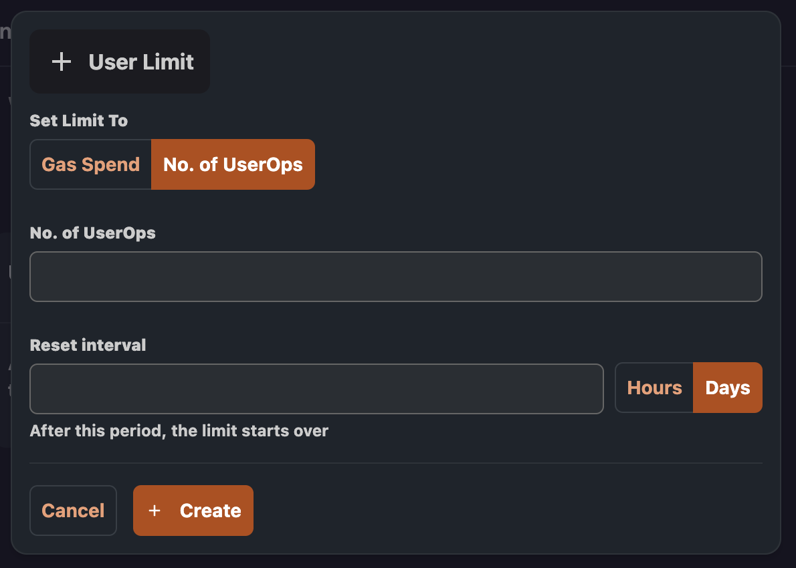

# Spending limits

This feature allows you to set limits to the gas usage. You can define global limits or per-user quotas, specifying either transaction count or total gas consumption.

## Add a global limit

Navigate to the Paymaster you have created, then click `Rules` and `Spending`.
If this is the first time you are adding a limit the page will look like this:

Click on `Add limit ` inside the Global Limit card and the new global limit modal will appear.
Inside the modal you will be presented with the option of choosing:

- Threshold type (Gas Spend | Number of user operations)
- Threshold value
- Cycle duration (minimum 1 hour, maximum 23 hours)

After clicking `Create` the limit will be created.

Please note that whenever the limit policy is edited (duration/ threshold/ threshold type), the cycle is reset, and the new cycle starts from the moment of edit.
Pausing/Activating a limit will not reset the cycle.

## Add a user limit

Click on `Add limit` inside User Limit card and the new user limit modal will appear.
Both the global and the user limit modals are very similar and offer the same options.

