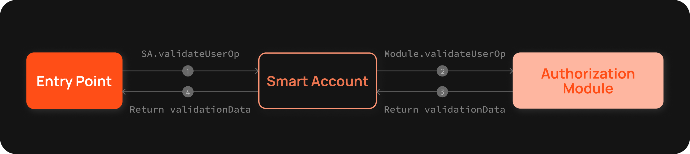
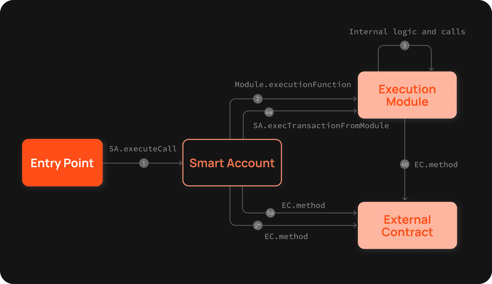

# Modules

Modular smart accounts (MSA) offer more flexibility than 'static' accounts. Static accounts often need a developer for changes and involve complex proxy upgrades. In contrast, with MSA the functionalities are moved to external contracts called `modules` to increase the speed of feature development. MSA lets users install or uninstall these modules, avoiding the need for entire account redeployment.

Biconomy MSA (Modular Smart Account) has two types of modules:

- **Validation modules** - These modules define different signature schemes or authorization mechanisms to validate who is allowed to perform what action on the account, by implementing standard interfaces.
- **Execution modules** - These modules define custom execution functions to facilitate the actions allowed by the account.

**Standardizing Modularity for Smart Accounts**

_ERC 6900_ is the first proposal that aims to standardize modularity for Smart Accounts, introduced by Alchemy in April 2023. It provides standards for how plugins (modules) should be written as well as how compliant accounts should add, update, remove, and inspect plugins.

Similarly, _ERC 7579_ enables developers to standardize these modules with minimal impact on the implementation logic of the account. It was developed by Rhinestone, Biconomy, ZeroDev, and OKX and presented in December 2023. This proposal outlines the minimally required interfaces and behavior for smart accounts and modules to ensure interoperability across implementations.

ERC 7579 is less opinionated and allows developers to experiment and innovate, making their own trade-offs around complexity and security. In contrast, ERC 6900 is more prescriptive due to an extensive description of all the aspects of compliant account behavior.

### How to enable modules

The Modular smart account is designed to be adaptable and flexible. Instead of storing ownership data internally or relying on a fixed signature verification method, it empowers users to choose their primary validation module. This flexibility, as part of Biconomy's [SmartAccountFactory](https://github.com/bcnmy/scw-contracts/blob/main/contracts/smart-account/factory/SmartAccountFactory.sol#L73), ensures each account can validate userOps effectively and support diverse user requirements.

Modules can be enabled using the following methods:

- During MSA deployment, a default validation module is enabled. Internally, it calls the [deployCounterFactualAccount](https://github.com/bcnmy/scw-contracts/blob/develop/contracts/smart-account/factory/SmartAccountFactory.sol#L57) method on the smart account factory. The module selected to deploy the MSA determines its final address, due to its counterfactual nature.

- A new module can be enabled via a userOp transaction on a smart account by specifying the module address and moduleSetupData. Internally, it calls [setupAndEnableModule](https://github.com/bcnmy/scw-contracts/blob/develop/contracts/smart-account/base/ModuleManager.sol#L196) method on Module Manager. It can be set as an active validation module to be used for the next transactions.

```jsx
const isEnabled = await smartAccount.isModuleEnabled(module_address);
if (!isEnabled) {
  const enableModuleTrx = await smartAccount.getEnableModuleData(
    module_address
  );
  transactionArray.push(enableModuleTrx);
}
smartAccount = smartAccount.setActiveValidationModule(module);
```

As per the code, the initial step is to verify whether the module is already enabled. If the module is not enabled, a transaction can be performed to enable it.

:::note
The module passed during the deployment acts as the default validation module. This module gets used as an active validation module if no other module is enabled.
:::

## Validation Modules



The validation Module is a module that extends the abstract contract **BaseAuthorizationModule\*\*** - which implements the **IBaseAuthorizationModule** interface. This interface requires the implementation of the following methods:

- `validateUserOp`: this method validates userOperation. It expects userOp callData to execute method calls of the Smart account and userOp signature being the ABI-encoded signature and module address.
- `isValidSignature`: this method validates an EIP-1271 signature.
- `isValidSignatureUnsafe`: this method validates an EIP-1271 signature but expects the data Hash to already include smart account address information.

Validation modules are invoked with a “call”. It has its own storage and doesn’t share storage with Biconomy Smart Account. Since validation module storage is accessed during the validation phase, ERC-4337 [storage rules](https://github.com/eth-infinitism/account-abstraction/blob/abff2aca61a8f0934e533d0d352978055fddbd96/eip/EIPS/eip-4337.md#storage-associated-with-an-address) apply to this.

:::info
Validation Modules in MSA play a crucial role in determining who can perform actions, ensuring security and proper authorization.
:::

Following is the list of Validation Modules:

- [**ECDSA Ownership Module**](ecdsa.mdx): This module is widely adopted as a validation module for Biconomy smart accounts. It can seamlessly integrate with MPC providers such as Web3Auth, abstracting EOA Private Key storage and enabling a web2-like experience such as email login.
- [**Multichain ECDSA Validator Module**](multichain.mdx): This module significantly improves UX for deploying and setting up Smart Accounts on several chains. It is an extension of the ECDSA Module enabling to dispatch multiple userOps on different chains using a single signature.
- [**Session key Manager Validation Module**](sessionvalidationmodule.mdx): This module enables the use of sessions to execute transactions. It verifies whether a given user operation adheres to the permissions defined within the session key and confirms that the operation has been signed by that session key. This can only be used as an active validation module.
- **MultiOwnedECDSAModule**: This is an alteration of the ECDSA Module which allows multiple signers to be set up, and any one of the enabled owners can authorize a transaction using the ECDSA signature.

### How to create a custom Validation Module

Developers have the flexibility to create a custom validation module according to their specific requirements. This validation module must extend the BaseAuthorizationModule, which further implements the IAuthorizationModule and ISignatureValidator interfaces.

**Key Imports and Their Roles**

1. `BaseAuthorizationModule`
   - **Core Structure**: Forms the foundation of your custom module.
   - **Link to Interfaces**: Connects to IAuthorizationModule and ISignatureValidator
2. `IAuthorizationModule`
   - **Operation Validation**: Manages validation of user operations (userOp)
   - **Method Implementation**: Defines methods for operation validation your module must implement.
3. `ISignatureValidator`
   - **Signature Security & Standardization**: Focuses on signature validation and adheres to the ERC-1271 standard for smart contract-based signature
   - **isValidSignature Method**: Essential for verifying signatures and ensuring security.

:::note

Adhering closely to the functionalities and specifications of these interfaces and standards is fundamental. It ensures your custom validation module operates securely and efficiently.

:::

After thorough testing and auditing, a pull request (PR) can be submitted to integrate the module with the SDK. A detailed walkthrough of the same is linked [here](/tutorials/customValidationModule).

## Execution Modules

**Execution functions** execute any custom logic allowed by the account.

There are two default execution functions - called execute and executeBatch which allow for open-ended execution that is required for AA-flow. The custom execution module needs to call back into Smart Account to initialize a function call from within the context of the account.
The diagram below illustrates the execution flow for Modular Smart Accounts.



:::caution
Execution modules should be carefully developed and integrated, as they directly control the actions an account can perform.
:::
